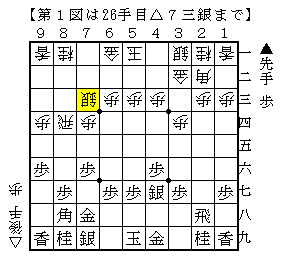
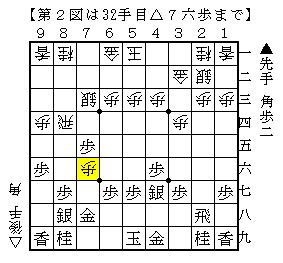
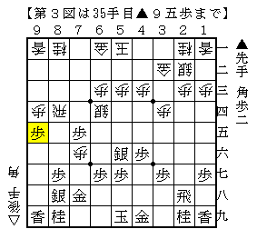
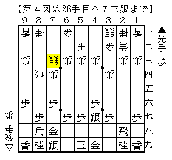
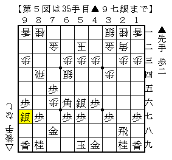

# [相掛かり]G.M.C.A  

数多くある筆者のバイブルの一つ「よくわかる相掛かり」を読んでいてふと気がついた。  

----------  

  

相掛かり引き飛車腰掛け銀に早繰り銀。  
先手中原流の流用で、筆者の実戦でこうなることも少なくない。  

ここから▲５六銀として▲６六角から７五の歩を守る指し方と▲２二角成とする指し方に分かれる。  
先手中原流対後手引き飛車であれば前者を選択して△１三銀～△２四銀を狙ってどうかというところだが、  
ここでは後者を選ぶ方が良さそうだ。  

  

つまりこうなった時に  

  

これがある。先後の差がはっきり出た格好。  
かと言って△７六歩▲５六銀に△５二玉では▲９七銀のような手が間に合ってくる。  

----------  

  

端歩を省略する指し方。  
先手は安全に▲４六歩とするために▲９六歩と突くしかないことがそれなりにある。  
この場合端の絡みがないので▲５六銀～▲６六角コースを選ぶことになる。  

  

極普通に進むとこれぐらいか。  
端歩を省略したここまでの経緯の関係上△５二玉型に限定されており、  
先手が割とやりやすい展開になっている。  

後手側としてはここに至るまでに何かしらの工夫が必要になるだろう。  
