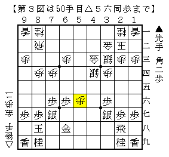

# [矢倉]哀愁氷点下  

  

△５三銀型は▲小林裕△橋本で指された▲６八銀という名手があり自信がなく、  
△８五歩型はそもそも中途半端であり、玉の薄さに見合っていない。  
右金を動かさない日浦流もあるが、対森下システムや▲６五歩急戦に課題が残る。  

よって、▲４六銀▲３七桂型を阻止するのであれば結局これしかないのではないかと思われる。  

１）▲４六歩  

  

△４七角に代えて△６九角～△４七角成とした実戦もあるが、  
１手遅れるので面白く無いというのが筆者の私見。  

１ａ）▲６八金寄  

  

【後手互角以上】  
後手にとって最も条件の揃ったコース。  
だからと言ってはっきり後手良しとも言い切れないのだが。  

１ｂ）▲５五同歩  

  

【いい勝負】  
△４四銀右が十分間に合っている展開で後手もやれる。  
実戦的に強い方が勝つ将棋だろう。  
他に単に△４四銀右や△７五歩▲同歩△６四銀という手段があるのもプラス。  

１ｃ）▲５七金  

  

【難解】  
▲６八金、▲７九金、▲５五歩など微妙に応手の組み合わせパターンが多い。  
後手を持って何とかなるという印象だが、初見で良くして勝ち切るのは意外と難しい。  
将棋世界誌にあった通り▲７八金型で▲５八金と引いて馬の捕獲を狙うパターンが強敵。  

なお▲５七金に△５六角成▲同金△同歩と進めるのも無くはないが、  
先手陣が乱れていないので面白く無いと思う。  

２）▲４八飛  

  

手順中▲４六歩に代えて▲１八香も有力。  
△５五歩▲同歩△５二飛といきなり突っかけてどうか。  

２ａ）▲６三角  

  

【形勢不明】  
▲小林裕△塚田や▲高見△田中魁のように△４二飛まで進めば後手もやれる。  
単に▲４一角成とする戦いに未解明な部分があるが、何とかなりそうでいて意外と難しい。  

２ｂ）▲５五歩  

  

【先手良しか】  
ショパン先生の記事で紹介されていた▲高田△佐藤義の進行ははっきりしない所があると思う。  
▲谷川△高橋で指された順が有力で、現状では後手側の課題と言える。  

----------  

とりあえず現段階での筆者の考えを簡単にまとめておく。  
何故こんな事をするのかと言えば、▲木村△松尾を見てやや満足してしまったから。  
そろそろ△４五歩にも飽きてきたところでもあり、別の後手矢倉に足を踏み入れてみたいと思う。  
