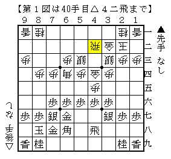

# [矢倉]哀愁スポーツ冒険家  

西尾先生の英語将棋ブログを見ていて驚いたこと。  

Shogi Openings: Yagura, Silver-46 Strategy  
http://kingcrimsondiscipline.blogspot.jp/2014/08/yagura-silver-46-strategy.html  

  

へええこんな手があるとは知らなかった。  
形が相当歪ではあるが、コンセプトがはっきりしているので一考の余地はあると思う。  
