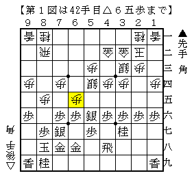
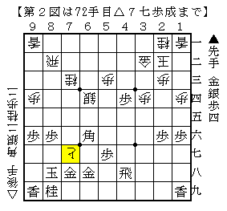
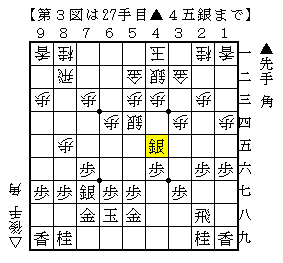
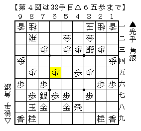
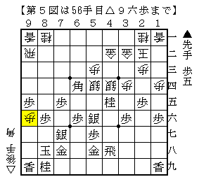
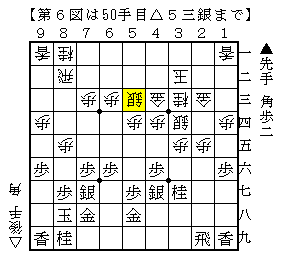

# [角換わり]リュウグウノツカイ  

８月末から１ヶ月間週末ごとに大会の続く多忙な生活が続いたものの、ようやく一段落。  
手痛い負けをいくつも喫してしまったが、こうして将棋が強くなるものだと思いたい。  

----------  

  

２手目△８四歩を指している以上、角換わり腰掛け銀は常に重要なテーマであり続ける。  
大平新手△６五歩は追随者がいないので良くない手なのかもしれないが、  
持ち時間の短い将棋であれば実戦的にはありだと思い採用。  
結果は完封負けでした。  

  

後日改めて検討してみた。  
類型の王位戦▲船江△渡辺と同様に進めてみると上図となり、▲同金右と取ることができる。  
戻って△５九銀（角）と割り打ちを入れても手抜いて攻め合われて自信なし。  
こういう攻め合いの展開は▲６八金右と固めた手が生きており、どうにもまずい気がする。  
もちろんここ以前に工夫の余地はあるのだろうが。。。  

----------  

  

▲４五銀とぶつける指し方はかなり有力だと筆者は考えているが、  
一方で▲５八金型ではさすがにやりにくいとも思っていた。  
図は▲５八金を見て△５四銀としたところ、颯爽とぶつけられて困惑した局面。  
△４一玉型に加え▲５八金と上がった形なので△４五同銀と取る一手なのだが、  
▲同銀△同歩の局面が茫洋として方針がまるで見えなかった。  
よって仕方なく△５五銀としたが、▲５八金と上がっている形が手厚い上に玉が近く既に不利。  

  

この将棋を指した数日後、B1の▲村山△木村でほぼ同じ将棋が指される。  
△３三銀は後に▲１七桂～▲２五桂が見えているので指しにくいと思ったが、  
△３五歩～△６五歩として圧力を掛けるのがなるほどという良い指し方。  
もちろんこの後も難しかったのだが、ともあれ非常に勉強になりました。  

----------  

  

現状筆者が指せそうな形といえば、王位戦第５局で出たこの形ぐらい。  
ただし▲２五歩とした３９手目に▲４八飛とすればどうなるのかという疑問もある。  
△４二金引▲２五歩△７四歩となれば合流するが、▲２五歩では▲１八香や▲６八金右もある。  
類型の王座戦第２局もよく分からないところが多い。  

  

変わり種として図のような指し方もあることはある。  
かつて奇襲本に掲載された作戦で、組み上がればひたすら入玉を目指していく。  
知人がこれを得意としており、筆者自身これを３局相手にしたがいずれもド作戦負けになった。  
急所が分かりにくい将棋で、いざやられてみると相当大変ではある。  

ところでこの作戦、初手から  
▲７六歩△８四歩▲２六歩△３二金▲７八金△８五歩▲７七角△４二銀▲２二角成△同金  
と進んだ局面から組み上げることが出来れば、角交換の２手得のうち１手得を活かすことが出来る。  
普通に角換わり腰掛け銀にするのであれば結局△３二金と戻して手得が無くなるわけなので、  
そういう意味では積極的な構想とも言えなくはないという気がしている。  
