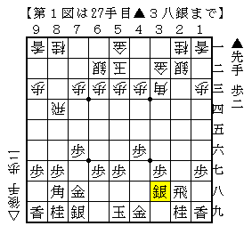
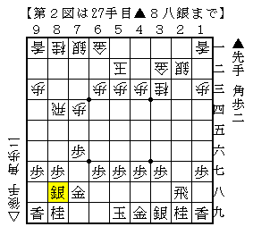
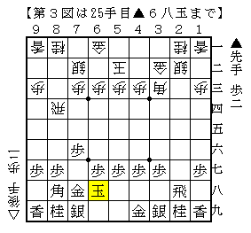
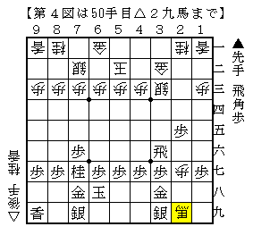
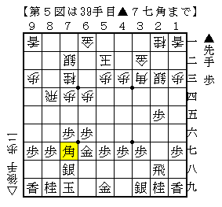

# [横歩取り]Funky Metal Radio  

変な指し方をたまたま思いついたので記しておきたい。  

  

先日発売された村田本でも触れられていた山崎流▲２八飛。  
早めの▲４六歩が▲２三歩△同銀▲２四歩△３四銀▲２三角の時の△２七歩▲同飛△４五角を消しており、  
△７四歩と突く筋を牽制している意味がある。  

そういう理由で図のように進めば先手の条件が良い。  
よって後手としては△６二銀に代えて△７二銀や△７四歩と急戦含みにしつつ４筋を緩和するのが優る。  

１）△７四歩  
▲４六歩とされる前に７筋を突いてしまう意味だが、一方で形を決めている意味もある。  
即ち△２四飛としにくくなったので▲３三角成～▲８八銀から持久戦を目指してどうか。  

  

後手が暴れるのであれば△７三銀型から△２五歩～△７五歩～△２四飛～△６四銀ぐらいだが、  
２筋は謝っておいて手厚く金矢倉を組みに行けば▲４六角の筋もあり、  
そこそこの模様を得られるのではないかと思う。  

２）△７二銀  
△７四歩と比べると形を決めておらず、△２四飛といきなりぶつける筋も当然あるところ。  
対して▲４六歩も当然考えられるが、▲２三歩からの決戦は７筋方面が広いので成否が微妙。  
持久戦になっても４筋攻めが緩和されている形なので、形を決めるのが得とも言えない感じがする。  

そこで代えて▲６八玉としてみてはどうか。  

  

対して△７四歩、△２四飛、△２三銀が考えられるところ。  

Ａ）７四歩  
やはりこれも▲３三角成△同桂▲８八銀と持久戦を目指してどうか。  
前述のすぐに△７四歩とした順に比べて▲６八玉と決めている分若干損だが、  
一応机上の研究では互角程度にはなると踏んでいる。  

Ｂ）△２四飛  
持久戦を目指すのであれば▲２五歩だが、△７四飛とされて少し困る。  
強く▲２四同飛△同角▲２三歩として、△同金なら▲３二飛、△３三銀なら▲２八飛でどうか。  
（なお△２四飛には▲３三角成△同銀▲２四飛が普通だが、▲３三角成に△２八飛成があるのでここでは損）  

Ｃ）△２三銀  
もう一手指してから次に△２四飛の狙い。  
ここでは先手の手が広く、▲３八銀、▲７七角、▲６六歩が筆者の候補手。  
（加えて▲６六角という手もあるかもしれない）  

▲３八銀と▲７七角は△２四飛に▲同飛と取って勝負しようという意味。  
ただ▲７七角の場合△２四飛▲同飛△同銀▲８四飛△２五飛▲２八歩△８三歩▲３四飛△２七歩▲３八金  
△２八歩成▲同銀△２七歩▲３九銀（▲同銀とは取りにくい）△２八角▲２六歩△１九角成▲２五歩△２九馬  

  

と進んでみると思ったより大変なので、飛車を取るのであれば▲３八銀が優るのかもしれない。  

▲６六歩は飛車を取らない方針。  
▲６六歩△２四飛▲２五歩△７四飛▲６七金△８四飛▲７八銀△７四歩▲７九玉△７三桂  
▲５九金△６四歩▲７七角  

  

が大まかに想定している進行で、次に▲６九金とひっつければ堅くなる。  
こういう進行になれば▲２五歩を打っていても△２三銀型も負担になりがちなので不満はないと思う。  
ただし右銀の活用を急ぐべきという考え方もあり、そちらを選ぶべきかもしれない。  

----------  

以上が概略。  
筆者自身まだ実戦投入できていないので、早いうちに試してみたいと思っている。  
尤も▲６八玉型で王座戦５のような将棋になっても不満がないとも思っているのだが。  
