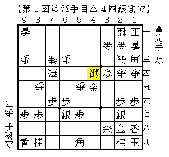
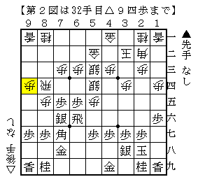
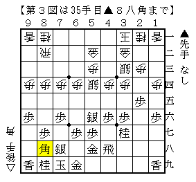
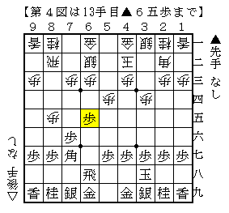
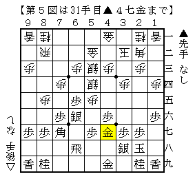
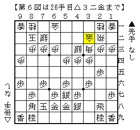
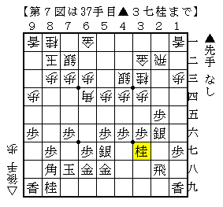
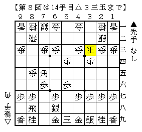

# [将棋生活]RUN.D.LOSE.MC  

この休日に二日制の[http://blog-imgs-42.fc2.com/d/a/i/daikyocclub/201411030907155b8.jpg:title=大会]に出場した。  
（画像右手前の空席が筆者。丁度トイレに行ったタイミングだったようで。。。）  

【予選１】  
予選は１勝通過、２敗失格。  

  

四間飛車穴熊だったので例の銀冠穴熊を採用。  
早い段階で作戦勝ちになり、駒がぶつかった図の局面ではっきり良くなった。  
快勝で予選通過。  

【本戦１】   
運営システムの都合上相手がなかなか決まらず、丸々一回戦遅れとなる。  

  

▲７六歩△８四歩▲７八金△８五歩▲７七角△３四歩に▲１六歩とされ手が止まる。  
△同角成▲同金から阪田流にされるのも鬱陶しいので大人しく△１四歩と受けたところ、図の局面に。  
明らかに居飛車側の模様が良く、そのまま千日手となった。  

  

指し直し局は３手目▲２五歩から角換わり腰掛け銀に。  
かなりリスキーな駒組みであったが、何だかんだ通ってしまったのが図の局面。  
ここまで来れば作戦勝ちで、珍しく一方的に攻め倒して快勝。  

【本戦２】  
豪腕で知られる超強豪氏と激突。  
この日は尽く知り合いが早い段階で超強豪と当たっており、筆者にも回ってきたかというところ。  

  

先手四間飛車から突然▲６五歩と揺さぶられる。対して△５三銀にも▲２八玉。  
△７七角成～△８六歩とするとどうなるのか正直筆者は未だによく分かっていないのだが、  
相手が相手だけに実戦では踏み込めなかった。  

  

その後５筋位取りを選択したため、結果的に前回と似たような将棋に。  
次に▲５六歩が来るが、単に△７三桂は桂頭を狙われるが△９四歩では直接利いておらず、忙しい局面。  
ここで△８六歩▲同歩△７三桂としたのがなかなか良い手段だったようで、  
▲６九飛△６四歩▲同歩△同銀▲５九角△６五歩▲７七銀と進みはっきり良くなった。  

結局この貯金が大きく、最後まで逃げ切り金星ゲット。  
教わろうという気持ちよりも倒してやろうという気持ちが自然と前に出たのが良かったのかと思う。  

【本戦３】  
勝てば枠抜けの一番。  

  

たまたま振り飛車党と知っている相手なので３手目▲２五歩を採用し、今度は向かい飛車対急戦となった。  
力の出しやすい展開になったと思っていたが、図から  
▲３七銀△２四歩▲同歩△同角▲２五歩△４二角▲４六歩△３三桂▲２六銀△６四角▲３七桂  

  

と進んであっという間にド作戦負けに。  
▲４六歩では△４五歩と反発されるのを気にして▲３七銀としたのだが、気にし過ぎであった。  
この後根性だけで指し進めるも一向に良くならない。が、どういうわけか終盤手前で千日手となり難を逃れた。  

  

指し直し局は升田流向かい飛車～▲７五角。  
この向かい飛車は実際の形勢評価と実戦的な勝ちやすさが双方向に解離するという奇妙な戦型で、  
未解明の部分が多いことも踏まえて筆者はかなり有力だと認識している。  

▲７五角は比較的新しい手法で、対して△３三玉を選択したのが図の局面。  
実戦はここで▲５五歩！？だったので△４四角でやや有利となったのだが、  
持ち時間が短いことに加え、千日手局で気力を使い果たしてしまったようで覇気のある手を指せず負け。  
二日目進出をあと一歩のところで逃すという結果に終わった。  

----------  

金星を挙げることが出来たなど内容的にはそこそこ自信を得られた大会ではあったが、  
目標としていた二日目に届かなかったのはやはり残念である。  
５０分４０秒という条件は筆者にとって喉から手が出るほど欲しい環境であるし、  
また超強豪氏を倒すだけ倒して実質アシスト役になってしまったのもどこかしら癪なものがある。  
一日で５～６局戦い抜ける将棋体力が筆者に求められている。  
