# [将棋生活]G.M.P.38  

「森下の矢倉」を知人の中学生氏に貸し出し、最近では専ら「有吉道夫名局集」を並べている筆者だが  
先日久々に数少ない筆者の先輩に当たる人物の棋譜を並べ直してみた。  

【１局目】  

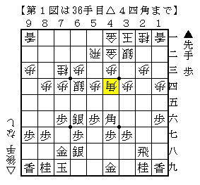  

左美濃急戦矢倉に対して▲６六銀型で対抗した将棋。  
ここから▲７五歩が意表の開戦で、以下△６五桂▲７四歩△７二飛▲６四角△同歩▲７三銀△７一飛▲６四銀成  

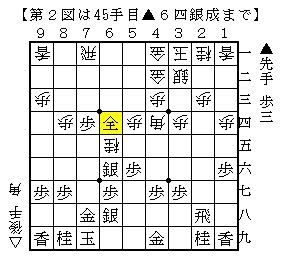  

こうなると角銀交換でも成銀の手厚さが抜群すぎて先手優勢。  
この後も丹念に攻め駒を回収していき、出来上がった投了図がこれ。  

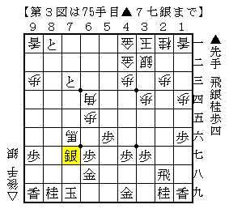  

圧巻の一言。  

【２局目】  

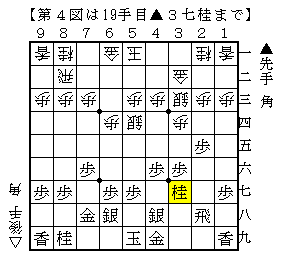  

対３手目▲２五歩から角換わりになった将棋。  
何気ない局面に見えるが、ここで△５五角としたのが序盤の妙手らしい。  

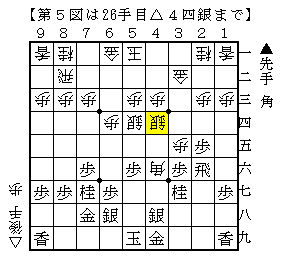  

数手進んで上図。確かにこうなってみると先手が辛い。  

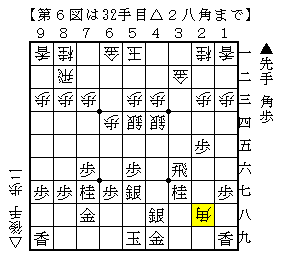  

しかしいくら良いとはいえ、これを間に合わせるのも強い。  
筆者にはそのような勇気はない。。。  

【３局目】  

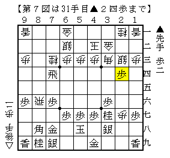  

後手横歩、対青野流に△４二玉とした将棋。  
▲２四歩は一目刺さっているように見えるのだが、ここからの３手が筆者の度肝を抜いた。  

△２四同銀！▲４五桂△２八歩成！  

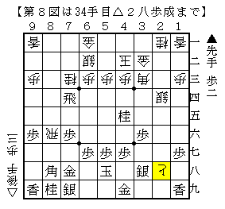  

さすがに駒損が大きいが、とはいえ意外と大変であることに驚かされる。  
この後▲３七銀△２七と▲４六銀△３七歩から２枚目のと金を作り迫っていく。  

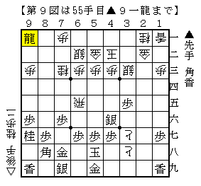  

更に進んで上図。ここから  
△３六と▲５五銀△３七と引  

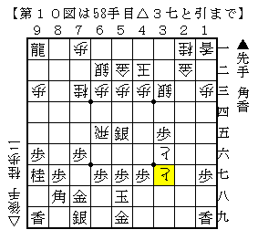  

▲５六歩△４七と寄▲６九玉△３五と  

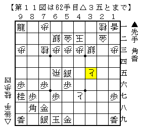  

上部の手厚さが凄いことになった。まさにお手本と言うべき指し回し。  

----------  

これらは氏の将棋の中でも特に特徴的なものだが、  
森下先生の将棋も然り、このような手厚い将棋の方が並べていて楽しいものである。  
