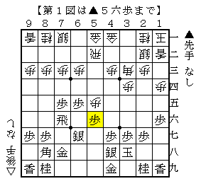
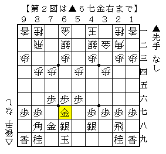
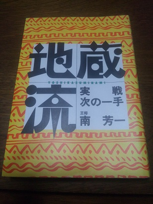

# [棋書]LET'S GO 三匹  

気付けば年が明けておりました。  
本年モ反省ノ色ナシStyleでいく所存でございます。宜しくお付き合いください。  

----------  

年末に購入した棋書がなかなか良いものだったので簡単に。  

１）中飛車左穴熊（杉本昌隆）  
安かったので購入。  

マイナビ電子書籍 年末年始◎将棋フェア  
https://book.mynavi.jp/ebooks_igo_shogi_fair/  

昨年やってみた２手目△８四歩というスタイルも悪くはないものの、  
何となく△３四歩に戻せないものかと模索しております。  
とりあえず左を指すことが出来れば  

・３手目▲６六歩対策問題  
・先手ノーマル三間問題  
・石田流問題  

がまとめて解決できそう、という安易な発想。  

最近見た左の実戦の中で面白かったのがC1▲高崎△大石。  

  

振り飛車側が上手く打開したように見える。検討課題。  

２）矢倉５三銀右急戦（村山慈明）  
分厚かったので購入。  

帯に書かれている通りの「謎の超大型戦法」の実戦例を時系列順に並べて整理してあるという  
ある種定跡書の一つの完成形と言えるであろう体裁となっているのが凄い。  

ところで実に初歩的な疑問があるので記しておきたい。  

  

まさに△５三銀右としようとしている局面。ここから  
△５三銀右▲２六歩△８五歩▲２五歩△８六歩▲同歩△同飛▲８七歩△８二飛▲２四歩△同歩▲同飛  
と力戦相掛かり調の将棋に持ち込むのが先手側の有力手段と見られている。  

ではここで先に△８五歩▲７七銀の交換を入れておき、それから△５三銀右とするのはどうなのか。  
△８五歩▲７七銀△５五歩とする将棋は一時期阿部健治郎先生が連採していたが、  
△５三銀右とした将棋は見た記憶が無い。  

３）地蔵流実戦次の一手（南芳一）  

  

良さしか感じられない。  

----------  

さて完全に負け負け日記となっていた弊ブログではありますが、  
今年はそれに加えて中継で見た将棋などについての簡易メモも貼っていきたいと思っております。  

というのも最近物忘れが酷く、以前なら「これは○○で見た将棋だ！」と思い出せていたのが  
「なんか見覚えがあるぞこの将棋。」→「んー思い出せん。」  
と出てこなくなることが実に多くなってしまいまして。  
自身の頭がアテにならない故、何かしら残しておこうということです。  

研究っぽいインチキな記事については相矢倉で一つ書いておきたいことがありますので、  
いつの日にか公開できればというところです。  

あと、たまには勝ち報告もしてみたいものですね。  

  

「負けないよ俺は～」  
