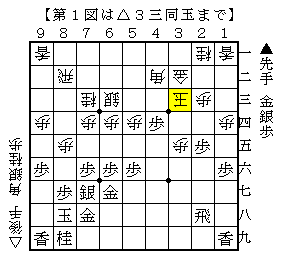
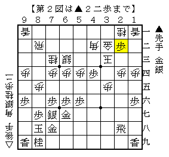
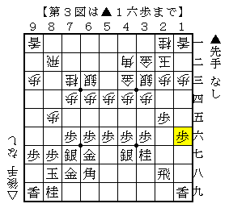

# [矢倉]TRIGGER ICE  

発売から既に半年近く経つが、「藤森流急戦矢倉」は実に好著である。  
元々▲４七銀▲３七桂型の同型矢倉に少し興味があったので、  
思い切って後手矢倉で米長流を採用する良いきっかけとなった。  

それにしてもこの同型矢倉、実に奥が深くて指しこなすのが難しい代物である。  

----------  

  

つい先程指した将棋から。  
両端を突き合い、▲４五歩△同歩▲３五歩の仕掛けから定跡手順通りに進んだ局面。  
「変わりゆく現代将棋」で解説されているのは▲４八飛△４五歩▲同飛△３四銀▲４八飛という進行だが、  
ここで▲２四歩△同歩▲２二歩と指された。  

  

本譜は端歩が入っているため△１三桂と逃がし、後に△２五桂～△３七桂成が実現して優勢になったが、  
端歩が入っていない場合はどう対処すべきだろうか。  
△同金も△同玉も▲４三金と打たれて鬱陶しいので、△３七角などとして上部開拓していくぐらいか。  
検討課題。  

----------  

  

こちら側の端歩を突かれることがたまにある。  
これ自体はなんでもなく△１四歩と突き返して後手の得になるのは間違いないのだが、  
手抜いて△６五歩と仕掛けた場合とどちらの方が得が大きいのか計りかねている。  

後手側を持ったら持ったで嫌なところが色々あるのだが、先手を持ってもそれは同様。  
この場合に限らず、この同型矢倉は端歩の関係も非常に難しい。  
