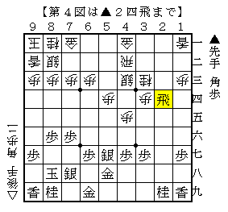
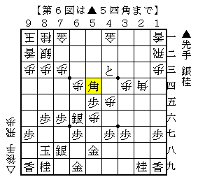
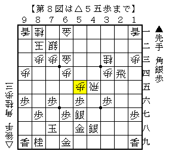

# [将棋生活]RUN.D.LOSE.MC 2  

すみません、またしても負け負け日記です。  

----------  

・某月某日  
主要アマ棋戦の地区予選に出場。  

【１局目】  
強豪氏のメリケン向かい飛車にショパン流△３三桂を採用。  
対超速の△３三角に代えて△６二玉とする将棋で似たような手があったが（69期C1▲佐々木慎△中田功）  
それを彷彿とさせる非常に良い構想だと思うので拝借させていただいた。  
両桂を跳ね出す形になり快勝。  

【２局目】  
後手米長流から同型矢倉に。  
相手から定跡を外してきたがそれがイマイチで快勝。  

【３局目】  
友人氏と同士討ち。後手四間穴に例の銀冠穴熊。  

  

飛車を転回する手は経験済みで、この手もその時気付いていたが大丈夫と判断していた。  
しかしここで▲２四歩に手抜いて△３六歩が成立するのが誤算。  
▲２三歩成△１五角となった局面は早くも自信がない。  
以下一方的に押し切られて負け。どうやらこの形にしてはまずかったようだ。  

----------  

・某月某日  
地区の団体戦に出場。  
出場チーム数の関係で総当り・五局指しとなった。  

【１局目】  
角換わり模様の出だしから両端を突き合い相横歩に変化。  
以前から気になっていた、いきなり端を攻める構想を試すも全然駄目。  
しかし粘り倒しているうちに相手が間違え、最終的には時間を切らして勝ち。  
両端突き合い相横歩も果たして後手の得になっているか難しい。  

【２局目】  
対横歩取り△３三桂。この戦法は掴みどころが難しく、やられる度に難儀している。  
９七の角を７五～６六へ、後に再び７五～９七へと繰り替えるなど今回もよく分からない戦いだったが、  
どうやらそれでポイントを稼げていたようで何とか勝ち。  
年末に完敗していた相手だったのでなんとも嬉しいものとなった。  

【３局目】  
３手目▲２五歩～鳥刺しを敢行したところ向かい飛車にされる。  
戦いが始まった局面が下図。  

  

ここで収めるのであれば▲２五同桂△同飛▲２八歩からじっくりやるところだが、  
それでは不満と実戦は▲２七歩△同飛▲２六歩△４三飛▲４五歩と進めた。  
しかし△５三角と引かれてみると・・・  

  

▲２五桂は△４五飛で角の支え方が難しく、△２五飛とされても困っている。  
この他いくら考えても歩の裏に回られる筋があり、ぱっとした受け方が見当たらない。愕然とした。  

ここで最大７分以上の差がついたのだが、その後ひたすら粘っているうちに相手も間違え差が無くなり  
お互い残り１分を切った叩き合いで大逆転。  
勝つには勝ったが、将棋の内容は褒められたものではなかった。  

【４局目】  
学生強豪氏相手に気合の３手目▲２五歩。角道を止めない四間飛車に。  
72期C1▲近藤△佐々木慎をイメージした駒組みを進めるつもりが、まるで違う将棋となった。  

  

△４三銀が早かったので早速仕掛けた局面。  
ここで▲２三歩と▲５三角の二択だが、実戦は前者。ただ後者も有力だったかもしれない。  
以下△５二飛▲２二歩成△５五歩▲６六銀△５六歩▲５五歩△６四歩▲２三と△３五角  

  

▲３三と△２四角▲４三と△１二飛▲５六角  

  

以降も直線的な攻め合いとなったが、好調に攻めているように見えて実は一手足りていないようで負け。  
この辺りは検討の余地が十分にあるので、これから調べていきたい。  

  

最後の詰みの局面。改めて見ると割と簡単だったか。  

【５局目】  
後手四間飛車に▲４五歩早仕掛け。  
振り飛車側の駒組みにやや隙があり、良い条件で仕掛けられるため棒銀ではなくこちらを選んだ。  
▲３三角成△同桂▲２四飛と走ったところで△５五歩とされたのが図の局面。  

  

この手は初めて見た。  
（念のため渡辺本をはじめ、少ないながらも手元の資料に当ってみたが確認できなかった）  
後の▲４四角のラインを消している意味もあってなかなかの手ではないだろうか。  

実戦は以下▲２一飛成△２五飛▲１一龍△２九飛成▲４九歩△２一歩▲４四角△５六歩▲同銀  

  

と進んではっきり良くなった。  
手順中最後の△５六歩が大悪手で、代えて△４七歩なら互角以上。  
こうなるのであれば△２五飛に▲同龍△同桂▲２一飛△２九飛を選ぶべきなのかもしれない。  
何とか勝てたが、この急戦をやるのも大変だと改めて感じた。  

なお、チームは結局４回戦に敗れたことで優勝を逃した。  

----------  

現時点での２０１５年筆者の成績：６勝２敗  
