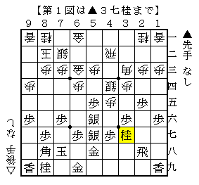

# [棋書]マンモスバーガー  

中継コメントでは様々な名言がデリバリーされてきたが、筆者が最も好きなのはこれ。  

>http://live.shogi.or.jp/oui/kifu/oui20100727_28.html:title>  
控室の奥の部屋から「マンモスバーガー」という言葉が聞こえてきた。  
何のことやら分からないが、離れていても副立会人の居場所が把握できるのは便利。  
<<  
マンモスとバーガーに接点がありそうでない。勢いを感じる。  

-----------  

  

アマレンで告知されていた冊子販売にて面白いものを入手した。  
何年か前に続編が出た際にそちらは入手して以来何度も読み返しているが、  
まさかこちらも手に入ることになるとは夢にも思っておらず、実に嬉しかった。  

９０年代前半の記事が大半で、あとはたまに９７年のものが数えるほどある程度。  
四間飛車対急戦だけで全体の四割ほどを占めている辺りに時代を感じる。  
今となってはこのような書籍はまずお目にかかれない。  

----------  

  

四間飛車対５筋位取り。  
以前筆者も居飛車を持ってほぼ同様の将棋を指している。  

ここから△５四歩▲４六歩となり全面戦争となるのだが、そうなれば振り飛車もまずまずのようだ。  
体感的に居飛車の手が遅れている感じがするし、故に筆者は▲１六歩を▲２四歩に代えた。  
それでいい勝負だと思っていたが、この記事の結論は  
「５筋位取りに▲６五歩と突ければ大体は振飛車が作戦勝ちになる。」  

ところでこの記事でも言及されているが、升田大山の名人戦でも同様の将棋がある。  
（１９６６年・第２５期名人戦第１局▲大山△升田）  

  

図から△５四歩▲同歩△４三金が好手順で振り飛車がペースを握った。  
これがあるのであれば、やはり５筋位取りで勝負するのは少し無理がありそう。  
（余談だが、以前同一人物によって著されたと思われる棋書で発見した時にはかなり驚いた）  

----------  

  

四間飛車対二枚銀急戦。著者のお気に入りの作戦らしい。  
ここから△８六歩▲同歩△７五歩▲同歩△６六歩▲５八銀！が面白い手で形勢難解。  
（そう言えば、やはりこれもある系列の棋書で見た）  

二枚銀は金駒がスクラムを組んで前に出ていくので好みといえば好みの展開だが、  
どうにもはっきりしない上に玉頭攻めまで食うので、実戦的には勝ちにくい作戦のような気がする。  

ところでこの記事には「おもしろ部」がある。  
>>  
北海道に観光で来ていた京大の学生さんとの将棋。ここからの振飛車の指し方が面白かった。  
（中略）  
～ならどんなことになったか。  
この学生さん、京大のサッカー部のレギュラーとか。まだまだ未知の強豪はいるものです。  
<<  
これに限らず結構こういう調子で書かれているので、楽しく読み進められる。  

----------  

  

あっ、この将棋！  
約２０年前だが、やはり考える人は考えているものだ。  

----------  

とまあこんな感じの１００ページあまりの冊子、お値段１０００円ポッキリ。  
執筆時現在で残り７冊とのこと、是非とも続編と共にお買い上げいただきたい。  

（20150711追記）  
電王戦で少し話題となった相横歩▲７七歩における▲２三角もこれに載っていた。  
恐らく初出はここなのだろう。  

渡部記者の将棋三昧＠相横歩取り隠れた新手  
https://book.mynavi.jp/shogi/blog/detail/id=38515  
