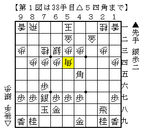
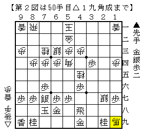
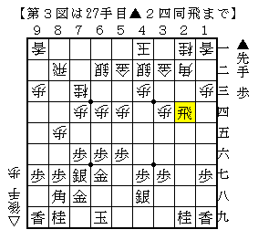
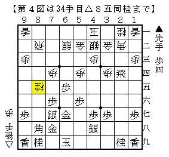
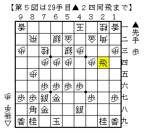
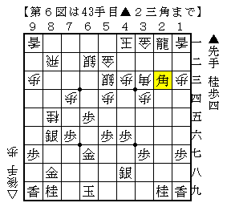
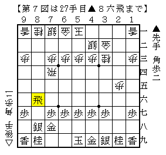

# [その他]チョコレートコロッケ  

唐突に横からその言葉が聞こえた際には驚いたものだが  
主に漬物などが並ぶ中、確かにそう書かれた札が存在していた。  
マンモスバーガーと並ぶ衝撃ワードとの遭遇を果たした瞬間。  

----------  

  

後手が一手損角換わりから右玉に組みに行く作戦はそこそこ遭遇する指し方。  
対するこの角も割とよく現れていると思われる。ネット上では１日５局ぐらい指されているのでは。  

ここから▲２三角成と突っ込めるかでこの角の成否が決まるが、  
△２七銀▲２四馬△３三金▲同馬△同桂▲４八飛△２八角▲３四歩△４五桂▲４六歩△１九角成  

  

の展開ははっきり後手良し。  
途中▲４八飛では▲５八飛が正着だと思われるが、それだと今度は▲４六歩から桂を取ることが出来ない。  
やはりこの角は無理気味だし、打ちたいなら▲２六飛と引くのが正しいという当たり前の結論が得られた。  

----------  

  

性懲りもなく続けている急戦矢倉。  
ここから△６五歩▲同歩△８六歩▲同歩△８五歩▲同歩△同桂という筋があることを先日初めて知った。  

  

うーん、なるほど。  
そうと知ったら早速実戦で使ってみたくなるのが人情というもの（？）  

  

第３図に▲４六歩△５三銀左の交換が入っている局面。  
６四の歩を手に取ろうとした瞬間にある局面が浮かんだ。  
即ち同様に進めていって  

  

銀が上がっているためこれで自玉が詰んでいる。  
よってこの仕掛けは無理と判断して△２三歩としたが、やや作戦負け。  

やはり一つの仕掛けが万能であるわけではないのだ。  
これも同型矢倉にするのが無難だったか。  

----------  

  

相横歩▲７七歩～▲３六飛。まさか現代将棋でこれが現れるとは。  
ショパン先生の記事でも出てきたことがあるが、筆者も実は何度か試みている。  

▲５六飛△４二銀の交換を入れずに▲８六飛は割とよく現れる形で  
先手もまずまずだと思うが未解明の部分((▲８六飛形で定番の△６四角やそのタイミングなど。そもそも▲２六飛に△２二銀は▲２一角で危険とされているが、本当にそうなのかも定かでないと思う。))も多い。  
瞬間壁になっているのが大きいと思っていたので、自ら解消する手段は考えてもみなかった。  

チョコレートコロッケのように、食の組み合わせも将棋の手の組み合わせも無限に広がっている。((なお、「悪くないが、もう一度食べたいかというと・・・」というのが食した二人の共通した感想だったような。。。))  

（20150711追記）  
第４図から▲８七歩△７七桂成▲同金寄で自信なしか。  
