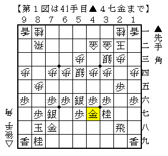
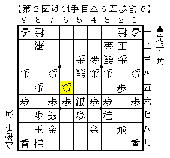
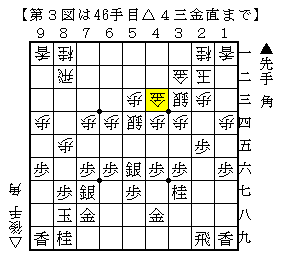
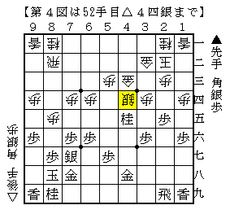
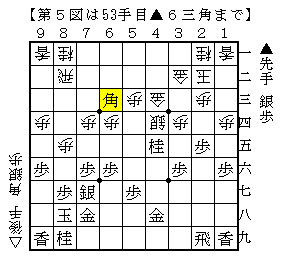

# [角換わり]１１９２  

いつもの道場、ある日の一コマ。  
珍しく師範が盤面とにらめっこしている。  

  

（あっ、これさうざんでいずで見たやつだ。。。）  

『（こちらを見て）これどうします？』  
「いやー、やっぱり▲４八金の瞬間に仕掛けるんですかねえ。」  

  

『これもなあ、金が下やったら自信あるんやけど、当たりが強いからなあ。』  
『感想戦でもやったけどあまり自信なくてなあ。』  

「実戦はまた違った進行ですか。」  
『金引いて飛車引いて金上がって。』  

  

（▲５八金として１手パスした局面に持ち込むのも結局どうしていいかよく分からなかったけど、  
　まあこっちの方が普通の指し方か。。。）  

『で、仕掛けられて。』  

  

「桂ではなく銀で取ったんですか。」  
『そう、それで歩を打たれるかと思ったけど、角打たれて。』  

  

（うーん、指し手が全く分からん。）  

『ちょっと自信ないかなあ。』  

※筆者の記憶力の問題により、発言の細部は実際と異なっている場合があります。  

----------  

「あれ、じゃあアマ強豪の方々は後手角換わりどういう将棋指してるんだろう。」  

ふと疑問に思ったので、昨年、一昨年のレーティング選手権の冊子にある角換わり腰掛け銀の棋譜を調べてみた。  
２年分５００局以上あるのでなんとかなるだろうと思っていたが・・・  

結果：３局  

後手棒銀、右玉を含めると１０局ぐらいにはなるが、それにしてもあまりに少ないので唖然とした。  
指さぬが勝ち、というわけでもないのだろうが、とはいえこれはちょっと拍子抜け。  
