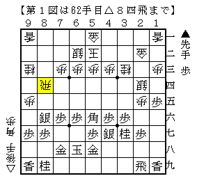

# [将棋生活]GYPSY TAIWAN DE JOE  

連休につき久々に遠征。  
こういう時はHigashiyamaShogiCenterに行くのがマイ定跡だが、今回は気分を変えてK道場へ。  

筆者の知っている道場は殆どが２段級差で角落ちとなるが、  
この道場は２段級差は香落ち、３段級差で角落ちというシステムになっている。  

勿論筆者は香落ち上手など殆ど持ったことがないし、定跡など覚えているはずもない。  
ただし見よう見真似とも言えないレベルであっても実際に指してみるのは重要だったようで、  
苦心しながらギリギリの捌きを通しに行く、その特有の奥深さを感じられて良かったと思う。  

ところで香落ちの棋譜をいくつか並べてみたいという気になったのだが、  
やはり天野宗歩など江戸時代の棋譜が中心となるのだろうか。  
この辺りの事情については筆者は極めて疎いのである。。。  

----------  

指した将棋から一つ。  

  

横歩取り△８四飛△５二玉に▲６八玉型で対抗。  
この局面は模様が良い上に、△２二金と大きな利かしが入っているので既に先手が良い。  

ここから▲９五銀△８一飛▲８六銀△８四飛▲９六歩  

  

△８五桂▲９五歩△７四歩▲９四歩△９七歩▲９五銀△８一飛▲９三歩成  

  

とひたすら端を伸ばしていき、  

  

▲９四と△８六角▲同歩△９八歩成▲同香△９七歩▲９五と△９八歩成▲９六と  

  

出来たと金を引き付ける。以下数手で後手投了。  
端にばかり指が行った珍しい将棋だった。  
