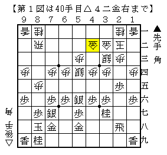
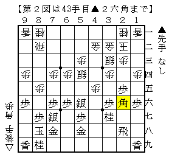
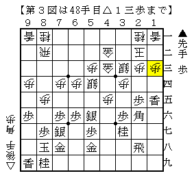
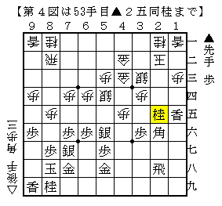
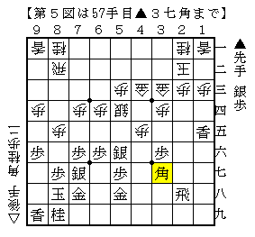

# [角換わり]撃つ用意  

[niconico:sm13004572]  
29:57 ～ 53:21  

将棋とHiphopは正反対の性質をそれぞれ持っているが、  
常にdigし続けることの重要さは根底で通じている。  

序盤中盤終盤、くまなくILLになりたい。  

----------  

同型矢倉や対振りをはじめ、相変わらず至る戦型で課題が山積であるのだが  
最近は角換わり腰掛け銀に興味が向いている。  

  

後手側を持つ以上▲２五歩型は条件が良いとされているのでなんとかしたいところだが、  
調べてみるとこれが容易ではない。  

図から▲４五歩△同歩▲２六角が古くからある仕掛け。  
筆者は角換わり腰掛け銀研究を読んで初めて知ったが、有力だと思う。  

  

△４三金左▲１五歩△同歩▲同香△１三歩  

  

代えて△１四歩もあり微妙なところ。違いはまだよく分かっていない。  

▲２四歩△同歩▲２五歩△同歩▲同桂  

  

▲４五桂△４四銀▲２四歩△同歩▲２五歩△同歩▲３七角として▲２四歩を狙うのが第一感だが、  
筆者が実戦で試してみたところ△１九角の筋などがあってそこまで自信を持てなかった。  
そもそも島本では▲４五桂に△４六角があるという指摘もなされている。  

△２三歩▲３三桂成△同金上▲３七角  

  

我が家のBonanza先生は△２四歩が優ると仰っていますが、人間的にはこちらを考えるかと。。  

さてここで後手の手が広い。  
持ち駒の桂を使うのであれば端を攻めるのが分かりやすいが、  
後手側は飛車に弱い格好なので▲６四角と出られるとかなり大変だ。  

よって△１九角として角を消してしまうか、△４六桂として角筋を止めてしまうか。  
前者は▲６四角や▲３八飛が、後者は▲４八金が考えられる応手で、形勢は難しいと思われる。  
実戦を重ねていきたい。  

（20150516追記）  
参考棋譜　▲森信雄△中田宏樹  
http://wiki.optus.nu/shogi/index.php?cmd=kif&cmds=display&kid=82833  

角換わり腰掛け銀研究で検討のベースとなっていた棋譜。  
某所旧譜氏に感謝。  

マイナー将棋ブログ - 新版角換わり腰掛け銀研究 実戦譜  
http://mainashogi.blog61.fc2.com/blog-entry-23.html  
