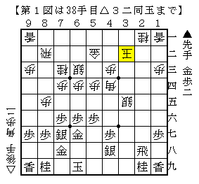
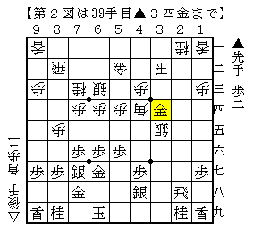
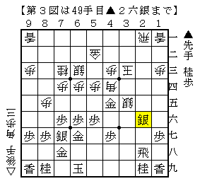
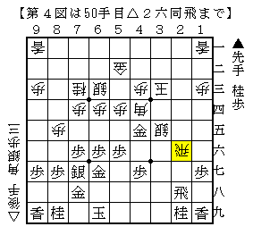

# [矢倉]CRIME JAZZ  

ネットの海を彷徨っていると、実に良いブログを発見。  

名南将棋大会ブログ 名古屋  
http://blog.goo.ne.jp/sazaemon0  

大会で現れた局面の次の一手を実に詳しく解説されており勉強になる。  
そして著者の関さん、強いですね。  
書いたものを読んで強いと思ったということは、筆者より少なくとも２ランクは上のはず。  

----------  

  

米長流急戦矢倉に▲３五歩の将棋。意外とよくやられる。  
本で書かれているのは▲３三歩△同桂を利かせて▲２二金や▲３四歩だが  
ここで▲３四金と打たれる将棋を立て続けに２局指された。  

  

単に△２六歩と打つのと△２七歩▲同飛△２六歩と連打するのがパッと見えるが、  
前者は▲３三歩△同桂▲２四歩とされて案外うるさい。  
以下△４五角▲２三歩成△４一玉▲３三と△２七歩成▲４四金△同歩▲４三桂と進んだのが筆者の実戦。  
△４五角～△２七歩成という方針も良くなく、はっきり悪くなった。  

よって△２七歩▲同飛△２六歩だが、▲３七飛や▲２八飛とかわされてどうか。  
前者は次に▲３五飛と切る筋を見せているが、実はこれ自体はなんでもない。  
とは言え△２八角では感触が良くなく、他に適当な催促の仕方がよく分からない。  
後者は△４九角としておいてどうか。  
形とばかりに△４五角は▲３八飛とされてヤブヘビである恐れがある。  

後手が良くなりそうだが、はっきりとした結論はまだ得られていない。  

----------  

  

こちらも▲３五歩の将棋。  
藤森本の自戦解説では△２六同銀▲３四歩△４二玉▲４四金△同歩▲１五角の筋があるものの  
先手急戦なので端歩が入っておりセーフ、ということであったが  
解説編では後手急戦で直前の△８一飛までで終わっている。  

ここで強く△２六同飛と取る手があるのでは、というのがBonanza先生の指摘。  

  

言われてみればなるほどの一手で、飛車の打ち込みに弱いのはむしろ先手の方。  
△４九飛が回ると受けが難しく、合駒を使わざるを得ず後手玉も安泰になる。  
今のところこれはかなり有力だと思っている。  
