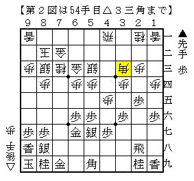

# [四間飛車]Biggaman  

某月某日。  

友人「強くなるのに一つの戦型に絞るのはやっぱり有効なんだよ。」  
筆者「確かに。２手目△８四歩は悪い指し方じゃないけど、どうにも分散している。」  
友人「だから君もそうしよう。何がいいかな。そうだなあ、四間飛車がいいな。」  
友人「とりあえず感覚身に付ける必要もあるし、１０００敗するまではやってね。」  
筆者「」  

このようなやり取りがあったかどうかはさておき、四間飛車を再びやることとなった。  

１）先手なら▲７六歩△３四歩▲６六歩、後手なら▲７六歩△３四歩▲２六歩△４四歩スタート。  
２）四間飛車になる将棋は四間飛車にする。  
３）居飛穴対策は△４四銀型（▲６六銀型）を用いる。  
４）先手で相振り模様になった際は向かい飛車にして相振りを受ける。  
５）四間飛車にならない出だしの場合は拘る必要なし。  
６）１０００敗するまで続ける。  

友人氏から言い渡されてた上記の設定に加え、  

７）基本的にオーソドックスな変化を選ぶ。変わった順は採用しない。  

筆者が独自に決めたの１つを加えた、これらのルールの下でとりあえず当面やっていきたい。  
本当に１０００敗するまで続くかどうかは分からないが、  
とりあえずそれ用の２４アカウントの運用は既に開始している。  

----------  

  

阿部健本で最有力とされている▲２六角型。  
ここから▲３五歩と仕掛けられると多少の変化はあれど、振り飛車側が芳しくない。  

  

そこで少し工夫してみたのが上図。△５四銀型の入江流の応用。  
この構えであればとりあえず▲３五歩の仕掛けは防いでいる。  
居飛車が超持久戦にシフトしたのを見て△９四歩とすればよい。  

問題はそれでも仕掛けられた場合。  
しかし▲２四歩～▲２二歩は△２四同歩でも△同角でも受かる。  
それ以外の仕掛けがあるかだが、先日Dr.A氏とこの局面をにらめっこした際には発見できなかった。  
現段階では有力だと思っているので、これを試していきたい。  

（20150810追記）  
ここまで来ればすぐの仕掛けはないようだ。  
ただしここに至るまでにも解決しないといけない宿題がいくつかあるし、  
そうして辿り着いた場所はスタートラインでしかない。  
