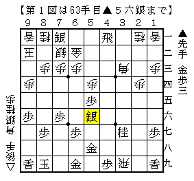
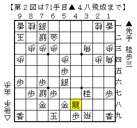
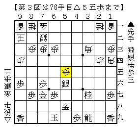
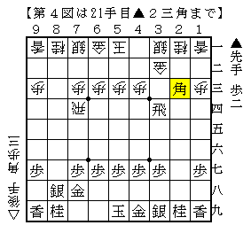
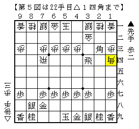

# [四間飛車]肉体改造Remix  

【現在の途中経過】  
２４：１００敗  
ウォーズ：２２０敗  
リアル：３０敗  

このうちどこまでカウントされるのかは分かりません。  

----------  

四間飛車ばかりやっているのでさぞかし研究が進んだと思いきや、  
肝心の穴熊対策は全く進むどころか停滞してしまっている状態。  
定跡書で一局とされている局面の次の一手が分からないというのがザラ。  

ということで斜め棒銀の将棋より。  

  

▲６二銀成とすれば▲７八金打という珍妙な手が出るあの将棋になるところだが、  
この▲５六銀もかなり有力。  

これを避けるなら直前の▲５五歩を△同角と取る手もあって、それにも▲５六銀となってどうか。  
馬が出来るのが大きいか、▲５九歩の余地が大きいか。  
筆者は現状後者の方が少し大きいのではないかと見ているが、何かが出てきてもおかしくない。  

△７七桂▲７八玉△６九桂成▲同玉△７七銀▲７八金△１四角▲４八飛成  

  

青野本にはこれで居飛車が良いのでは、とされていたが。  

△６一金▲７七金△７一金▲３九龍△５五歩  

  

７七の銀と３九の飛車の２枚取られても、７一の銀を取り返せば駒の損得がない。  
１四と３三の角がそれぞれよく利いており、結果図は少し振り飛車が指せると思う。  
自玉に簡単に手がつかないのも大きい。  

----------  

大会の会場で知人が検討しているのを覗き見。  

  

（おやあ見覚えのある局面だ。。。）  

相手「これなかなか後手が良くならなくて。」  
知人「ふうん。・・・こういうのはどうなん。」  

  

検討相手の方、訝しがる。恐らく筆者の顔も一瞬歪んだことだろう。  

だが、しかし。  
▲１四同角成には△３四飛  
▲１四同飛には△同歩▲５六角成△２四飛▲２八歩△５二玉  
▲７四飛△同歩▲５六角成には△２六飛▲２八歩△５六飛▲同歩△４七角成  
でどうか。  

相手「これは案外いい手かもしれない。」  

筆者も同意見。先手が良くなってほしい戦型だが、案外これは有力だ。  
有志の方は是非検討を。  

（20150919追記）  
これをものの５分ちょっとで弾き出したH嶋君、あなたのセンスに脱帽です。  
