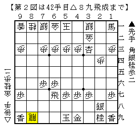

# [横歩取り]洋酒ケーキ  

  

久々に指しました。リアルで指したのは３局目ぐらい？  

対していくつか後手にも手段があるが、今回は△６四飛。  
▲６五歩△同飛に▲５六角もあるところだが、▲６六歩が妥当なところだと思う。  
で、下図までは進む。  

  

短考で▲４八玉と上がったが、▲６九桂と打った方が良かったようだ。  
というのも、△１九龍とされた局面ですっきりした手が見つからなかったから。  

  

実戦は▲３二成香△同銀▲４五桂。  
明らかに変な桂で打ちにくかったが、△４四香の筋を緩和する必要があると思った。  
まあしかし、やはり普通に考えてこれは疑問手だろう。  

  

なんやかんやあってこうなり、△４五金だったので命拾い。△２五香ぐらいで大体負けてそう。  

結局第３図ではっきりすっきりという類の手がないのであれば  
最初に▲６九桂を選ぶべきだった、ということになりそうで。  

----------  

・・・とここまで書いてようやく気付いたのだが、▲６六歩ではなく▲７七桂なんですね。。。  

横歩取り 横歩取り△４五角戦法の最新研究  
http://ameblo.jp/shogi-strategy/entry-11252971887.html  

ぱっと見は△６八金▲４八玉△７七成銀でどうなんかなーというところだが、  
▲３二成香△６九金▲７七馬の瞬間飛車の打ち場所がないですか。  

  

△３二銀と手を戻すぐらいだが、適当に▲８三角とか置いておけば先手が良さそう。  
▲６六歩よりこちらの方がすっきりしていて良さそうですね。  

（20151022追記）  
後日もう一度同じ相手と指した際に▲７七桂を採用。  
大体どの順も先手が余しているという結論になった。  
やはりカステラ新手は優秀だ。  
