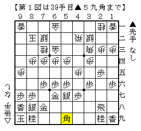
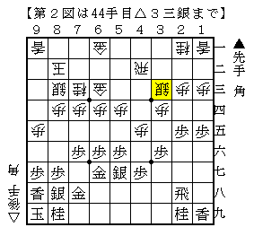
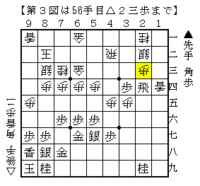
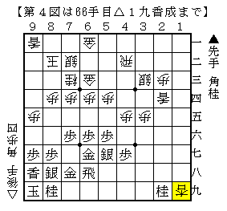
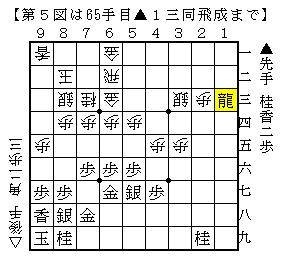
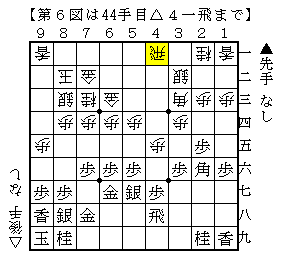

# [四間飛車]Brothers On The Run  

もう１１月も下旬ですか・・・  
９月１０月と突然忙しくなったので、気付けばこんな時期という感じ。  

【現在の途中経過】  
そんなこともあってよく分からなくなりました。  
前回から＋３０～４０局ほどと思われるので、累計３８０～３９０局ということにしておきます。  

----------  

先後どちらも四間飛車で、しかも▲６六銀△４四銀型縛りというのはさすがにしんどく、  
将棋そのものへのモチベーションに影響を及ぼし始めていたので色々と緩和することに。  
先手では普通に居飛車、後手番では四間飛車で主に△３二銀型を指すというのがここのところの方針。  

とはいえ△３二銀型も課題が山積であることには違いない。  

  

阿部健本にもあった角転換型。  
ここで△１六歩が普通だが「△８三銀も考えられる」ともあり、筆者好みはこちら。  
そう指すと大体は▲１五角とされるが、△同角▲同歩△３三銀。  

  

▲７九金や▲３七桂といった手であれば△７二銀となって居飛車が簡単には打開できない格好。  
よって仕掛けるならここしかない。  

  

大体無理っぽいとした仕掛けではあるが、振り飛車側も結構危険な格好をしている。  
６一の金が浮いているので▲２四歩には△同歩に限定されており、ここまでは進みそう。  
そこで１）▲２八飛　２）▲１四飛　の２つが考えられる。  

１）▲２八飛  
次の▲３三歩成に期待する指し方。  
それ自体は受からないで△７二銀▲３三歩成△同桂▲３四歩△２四香▲３三歩成△同銀▲６八飛△１九香成  

  

こう進んで難しいながらも振り飛車も悪くないか。  
１筋からの部分的な無血上陸が望めそうだが、玉頭で暴れてくるので実戦的には大変だと思う。  
それに備えるなら手順中△７二銀を△７二金とするのも当然あるところ。  

２）▲１四飛  
香を取って自然な手。  
△１三香▲３一角△６二飛▲１三角成△同桂▲同飛成  

  

こう進むと角と桂香の交換で振り飛車側が大きな駒得だが、一方で向こうに全く手がついていない。  
ぼやぼやしていると▲３七桂～▲４五桂の応援まで間に合ってしまうので容易ではないと思われる。  
振り飛車が駄目というわけではないだろうが、検討課題。  

ちなみに阿部健本では▲１五角とぶつけるところで▲２六角とするのを本手順としている。  
これには△７二金▲４八飛△４一飛としてどうか。  

  

銀冠や飛車引きを咎めるなら▲６八角～▲４八銀だが、角転換を済ませているのでそれがない。  
△５一角～△６二角とこちらのコースから角をぶつけるのが次の狙い。  
銀冠まで組んでいるので簡単に堅さ負けしない展開になるというのが机上の研究だが、  
実戦で現れていないのでまだなんとも言えないところだ。  

----------  

去年の１２月にAdvent Calendarなるものを知り  
翌年に「将棋Advent Calendar」なんて出来たらいいなと思ったりしたのですが、  
どうやら既に存在しているようです。  

<del datetime="2015-12-17T19:35:57+09:00">将棋 Advent Calendar 2015</del>  
<del datetime="2015-12-17T19:35:57+09:00">http://www.adventar.org/calendars/1073</del>  

気が向いたら投稿するかもしれません。  

（20151217追記）  
なんだかんだ言ってる間に消えてました。  
