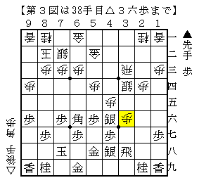

# [その他]類１６世  

  

石田流に４手目角交換。  
▲同飛は難しいところもあるが居飛車がやれる将棋だと思う。  

▲同銀に△５四歩が長岡本などで解説されている手法でよく用いているのだが  
手の広くて方針のはっきりしない将棋になるので、筆者には持て余し気味であった。  
そこで、代えて△１四歩と突いてみる。  

△５四歩と違って▲７八飛を牽制できていないが、△３二銀で定跡形に戻る。  
▲５八金右△１五歩の展開はよく分からない点があるが、端の主張もあるので一局か。  

▲１六歩に△４五角が定跡だが、これはこれで難解。ただ筆者としてはそちらよりも  
△３三銀▲４八玉△２四歩▲３八玉△２五歩▲２八玉△４四銀▲３八銀△２二飛  

  

を選びたい。  
72期B2▲戸辺△窪田と比べると△１四歩に▲１六歩と受けてくれている分後手が得していると思う。  

（20151217追記）  
やってみたら見た目以上にまとめるのが難しい。  
ぱっと見の時点で既にまとめにくいだろうという話もあるが。  

----------  

  

またしても斜め棒銀。  
自分でやる気はしない一方で、やられたらかなり大変な作戦である。  

定跡通り△３七歩とするつもりが、文字通り手が滑った。  
仕方がないのでそのまま指し進めてみると  

  

あれ、優勢。  
ただどう考えても直前の▲３四歩△同飛▲１一角成がやりすぎなので、▲２二歩と手を替えてみる。  
▲２二歩△２五歩▲２一歩成△２三飛▲１一角成△２六歩▲１二馬△２七歩成▲３六飛△同銀▲２三馬△３八と  

  

あれ、意外と大変。  
振り飛車が良いとは言えないが、△４六歩もあるので居飛車良しというほどの差でもないような。  
まあこうはならない気もするが。  

戻って最初の図で▲３三角成△同桂▲３六飛。  
△３五歩▲同銀△同銀▲同飛△４四角の進行は  

  

ここで歩がないので端攻めの厳しさがない。  
形の違いを咎められたか？と思ったところで、一番普通の△２五角を発見。  

  

あれ、振り飛車が良さそう。  

狙って指したわけではないが、△３六歩もない手ではないようだ。  
もっとも一番最初に▲２二角とこちらから打たれる順も考えないといけないのだが。  

（20151217追記）  
△２三飛に▲２七桂がありました。次に飛車に当たるおまけ付き。  
