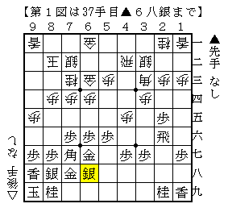
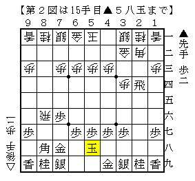
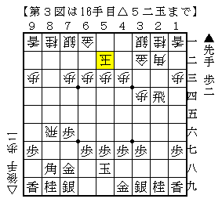
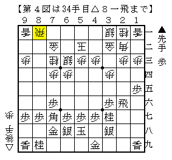
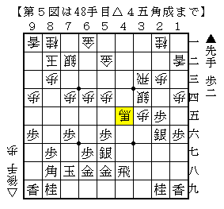
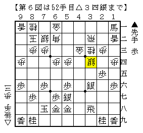
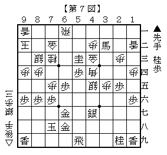

# [将棋生活]S Meets D.R.A. And GrandMasterY In Future Funkamentao In B.B Space 3000  

某月某日・某団体戦。  
A氏とその師匠のY氏にかなり無理を言って参加していただいた。  

【１回戦】  

  

四間飛車対居飛穴。  
直前の▲２六飛の意味が全く分かっておらず、銀を引かれて動揺。  
そこで慌てて△４四角▲３六飛△３五角としたのが輪をかけた悪手で、▲同飛で困っていた。  
よって▲３六飛には一度△３三銀かもしれないが・・・  

実戦はそれを見逃してくれたので一局の将棋に。  
得した駒をひたすら自陣に足して厚みを築く分かり易い展開となり、なんとか勝ち。  

一方隣ではA氏が御年８０前後の兵庫県棋界のレジェンドと華々しい攻め合いを繰り広げていた。  
残念ながら届かなかったが、Y師はきっちり勝ってチームも勝ち。  

【２回戦】  
先手番で対一手損角換わり。  
馬を作らせるという見たことのない駒組みをされたが、作戦として上手くいっていないようだった。  
チームも快勝。  

【３回戦】  
先手番で横歩模様に。  

（最近横歩で冴えた指し方って無いしなあ・・・）  

  

相手は少考の後  

  

（しまった、これは全然考えたことのないやつだ。。。）  

そうして組み上がったのが下図。  

  

見事な作戦負けです。本当にありがとうございました。  
以下個人もチームも負け。  

（20160114追記）  
C2▲阿部光△遠山で▲５八玉△５二玉の局面が出現。  
▲２二角成～▲７七角とするようでは先手が思わしくないと思われる。  

【４回戦】  
（この辺りから棋譜が全く並ばない。前の負けが相当がっくり来たらしい。）  
先手番で四間飛車に棒銀。  

  

▲３五歩に△７四歩の将棋。好みではないが決戦に出ざるをえない。  
相手の馬を負担にするには一度相手に動いてもらうのがよいと判断して▲２四歩～▲２二歩。  

しかしそうやって幸せになれる人が当然いるはずもなく。  
普通に▲３七銀～▲４六銀右と活用する進行が優るとY師に指摘される。  
やっぱりそうですよね。。。  

この後少し悪い将棋を色々頑張ったものの、立体的な囲いが生きる展開で差が埋まらず負け。  
チームも１－２負け。  

【５回戦】  
またしても四間飛車に棒銀。  

  

△４五銀～△３四銀の屈伸作戦だが、決戦に出て居飛車悪くない、が通説。  
ただ渡辺本にある▲２一馬～▲６六歩という指し方が実戦的にもより優ると思う。  

  

急所の局面をおおよそ再現したもの。  
間違いなく６筋のどこかを間違えているのだが、最早ほとんど記憶が残っていないので分からない。  
ここで▲６四桂と打ったのが大悪手で、利かしのつもりが手抜いて攻め合われ大変なことになった。  
第一感に従って▲４三成桂から根本の角を取りに行くのが正解。  
前局に続き最後の最後まで時間を使い切ったが負け。  

チームは２－１。  

----------  

総合成績は３－２、個人成績は２－３。  
もう少し頑張りたかったなあ、というのが正直なところですが、極めて有意義な時間を過ごすことが出来ました。  
楽しい記憶とともになんとか年を越せそうです。  
一緒に出ていただいたお二人に感謝感謝、本当にありがとうございました。  

（20160331追記）  
その後Y師とは別の団体戦でうっかり激突（笑）  
試合前の談合により直接対決は回避されましたとさ。  

----------  

余談。空き時間に頂戴した一般的な（医学的でない）助言。  
「肩凝りに葛根湯は有効。飲み過ぎはよくないが。」  
