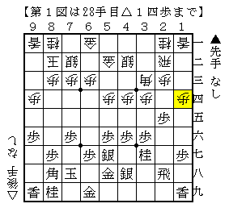
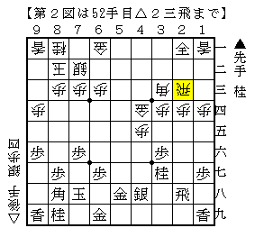
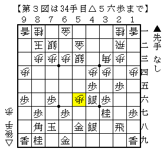
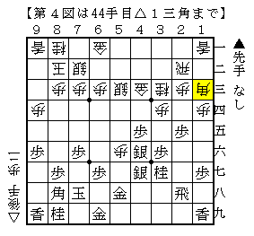
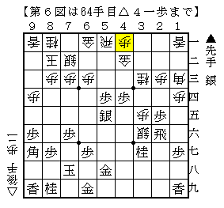
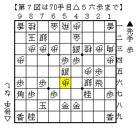
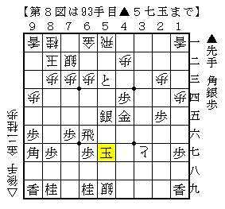

# [三間飛車]DAYONE  

少し前に指した筆者の実戦より。  

  

出た、端歩。つまり  

  

こういうことなんだけど、ものの本によると▲３一成銀△５五歩▲３二成銀△５一角▲９七角で居飛車良し。  
確かに最後の端角が妙に受けにくく、△６四歩ってこんなところで効いてるんだ、という気持ちになる。  
もっとも筆者が実戦で試した感触では居飛車が良いと言えるほどの形勢ではなかったが。  

そんなこんなでそうなるものだと思って指し進めてみると  

  

あれー？  

  

あーそういう。指されたことは勿論無いのだが、手としては見覚えがある。  
対策も考えたことがないので、とりあえず一番自然な▲３五歩△同歩▲２六飛で応じる。  
△２四歩は▲同歩△２五歩▲同桂△２四飛▲３三桂成△２六飛▲４三成桂が部分的な定跡。  
これもそんなに簡単だとは思わないけど、△１三角と手放してくれているので条件は良い。  

実戦は△５二飛▲５六銀△６四銀▲５五歩△４二金  

  

歩を払えたのでひとまず安心。  
ただ図の△４二金は指された瞬間手強いと思った。  
次に△３六歩▲同飛△４六角▲同飛△３五銀▲４九飛△３六歩が来る。  
もっともそれをやらせてもいい勝負なのかもしれないが。  

△４二金には▲４四歩が筋だと思ったが、△５三銀が気になる応手。  
一歩あれば▲５四歩△同銀▲５五歩でそれまでなのだが。  
よって▲５四歩△同銀▲５五銀右とするのかもしれないが、  
△同銀▲同銀の局面は相変わらず歩切れで技がかかりそう。△５七歩ぐらいでもよく分からない。  

実戦は△５四歩だったので運良く杞憂に終わった。  
▲５四同歩△同飛▲５五銀右△同銀▲同銀△５一飛▲５四歩△３六銀▲９七角△４一歩  

  

▲５四歩と打てて少し良くなったとは思った。  
△３六銀は感触が悪いがこれぐらいしかなく、実際筆者も指されると思って進めていた。  
冒頭で触れた▲９七角がついに実現してははっきり良し。  
しかしここから決め損なう。  

▲４三銀△５七歩▲４八金△５八歩成▲同金上△５六歩  

  

▲４三銀が疑問手で、▲３四銀とゆっくりやって十分間に合った。  
対する△５七歩は悪手。直後に成り捨てた上に５筋が厚くなり、手番を渡すのでは酷い。  
大体は居飛車の勝ちとした局面だが。  

▲４二銀成△同歩▲６八金打△５七銀▲同金右△同歩成▲同金直△３七銀不成▲６六飛△４五桂  
▲５六金△３六歩▲３五歩△同角▲４五金△６八角成▲同玉△４八銀不成▲６九桂△３七歩成  
▲５三歩成△５九銀不成▲５七玉  

  

時間に追われて指した▲４二銀成～▲６八金打がお返しの悪手で、分かってはいたが受けになっていない。  
正解はもちろん▲３八歩で、先の図を見れば誰だってそう指すところ。  

長手数進めたが居飛車玉が完全に露出して大変な局面になっている。  
厳密にはまだ難しいのかもしれないが、如何せん切れ負けで残り２分対１０分では勝てない。  
以下指し続けるも、中段玉が捕まって負け。  

ここのところ酷い将棋ばかりでろくなことがない中、これでも少しはマシな将棋を指せたほうだと思う。  
切れ負けで相手の時間を切らしてしか勝てていなかったが、珍しく切れ負けが勿体無いと思えた将棋だった。  
