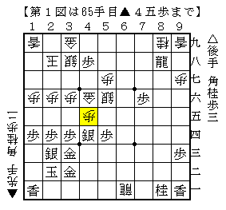
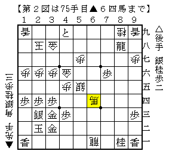
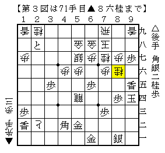
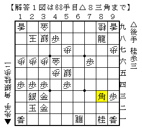
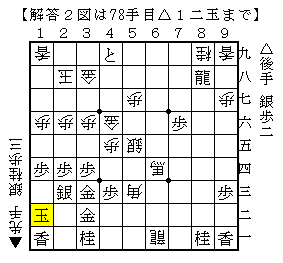
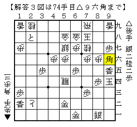

# [将棋生活]マッスル志願２  

本年最初に参加した大会は準優勝。  
決勝は相手が序盤早々大ポカするというスーパーチャンスが訪れたものの負け。  
まだまだ振り飛車スキルが足りていない感じ。  

----------  

最近指した筆者の実戦より。  
いずれも後手故に図面を上下逆とした。  

１）  
  

形勢は悪い。切れ負けなので少しでも敵玉に嫌味を付けておきたい。  

２）  
  

前問の続き。相手の残り時間は１分を切っている。最後の勝負手。  

３）  
  

冷静に見ると・・・  

解答は続きにて。  

====  

１）△５五銀▲同銀△８三角  

  

４八の歩が相当邪魔な駒になっており敵玉が全く見えない。  
銀を犠牲に角を打ち、切り飛ばして歩を成った局面はとりあえず敵玉が見える形になった。  
ただし形勢が好転しているかというと、むしろ悪化している恐れすらある。  

２）△３一桂▲５三角△１二玉  

  

形勢はかなり悪いので時間を切らすしか勝ち目がない。  
△３一桂▲５三角に△１二玉が習いある振り飛車の手筋。  
▲３一角成△同金の形は自玉は詰まず、敵玉は△３九角からの詰めろでこれは勝ち。  
そこで▲６八歩が受けの手筋だが、△２二銀と埋めると一気に自玉が見えなくなる。  
△６八龍の時間稼ぎもあり、時間切迫の相手が焦る展開だ。  

なお実戦は▲３一角成△同金▲同馬だったので△３九角が打ててしまった。  

３）△８六同角▲同歩△９六角  

  

なんとこれで頓死。戻って直前の局面で▲８二銀～▲８一銀不成ではなく  
じっと▲６五龍とでもしておけば楽勝だったと思われる。  

もっとも筆者もこの頓死筋を逃してしまったのでド必敗に陥るのだが、  
たまたま相手が切れ負けに慣れておらず命拾いしたのであった。  
