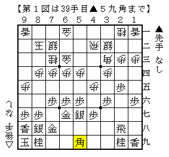
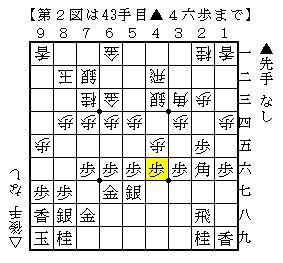
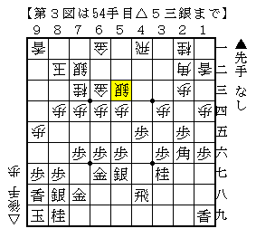
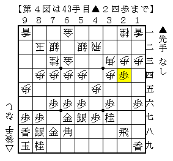
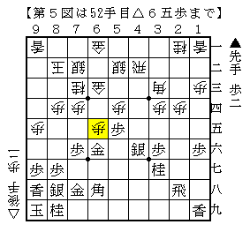

# [四間飛車]マッスル志願３  

タイトルを考えるのが面倒なので当面これで行きます。  
あとなんだかんだで四間飛車は飽きずに指し続けています。  

----------  

  

相変わらずこれ。  
以前△８三銀を検討したが、９筋を突き合っている形を考慮した際に代わる手が難しい。  
結局△１四歩を掘り進めることとなり、阿部健本の手順との衝突が避けられなくなった。  

▲２六角には△４一銀が第一感だが、阿部健本の手順通り４五の歩を狙われてまずい。  
筆者としてはこんな「やっぱり今の～なし！」という順は許したくないが、対策は見つかっていない。  
居飛穴は時としてこういうことがまかり通ってしまうのがズルい。  

  

そういうことでこの局面。違和感のある仕掛け。  
△４四銀と数を足せないので、△５二銀と飛車のラインを通してみる。  
以下▲４五歩△同飛▲４六歩△４一飛▲３七桂△１二香▲４八飛△２二角▲４五歩△５三銀  

  

ここまでの手順が必然とはまるで言えないが、筆者の棋力では変化する箇所もよく分からず。  
当初ここで▲４六銀から押さえこまれると思っていたが、  
△６五歩▲５五歩△６四銀と進んだ局面はよく分からない。  
▲６五歩△５五銀▲同銀△同角▲６四銀のような展開は振り飛車もやれるはずだが、  
具体的にはっきり良いという結論を得るまでは至っていない。  

しかし▲４六銀以外の指し手もよく分からず、  
なんとかこれでやれないかな、と思いながら実戦で現れるのを待っている状況である。  

----------  

  

三浦阿部健本でもあったこれ。  
「この変化を△２四同角のコースで頑張って解決すれば、常に▲１六歩に△１四歩とできますよー」  
という石井本の主張が通れば先述の分かれも関係なくなり話が早いのだが、  
どうにも筆者には△２四同角コースがうまくいくように思えないのである。  

  

一歩多いので一度△６五歩と打つ余裕がある。  
▲５六金はC1▲阿部健△千葉が実戦例としてあるが、これはこれで結構大変だと思われる。  
どうにも筆者には振り飛車側の攻めが一度途切れ、いつの間にやら再び繋がったように見える。  

とはいえ▲６七金というのもおかしな手で、突き捨てて仕掛けていったのに相手に手を渡している。  
そこでいきなり攻めて上手く行かないのであれば、次は「手渡しには手渡し」が自然な発想だと思う。  
ということで筆者は今△４三飛と浮く手を考えているのだが、これも実戦待ちという状況。  

同様に△４一飛と下がる手も考えられ、むしろこちらの方が自然に思えるのだが  
これには▲４二歩△同角▲２三歩と垂らす手があると思う。  

  

振り飛車自信がない気がするのですがどうなんでしょうね。  
