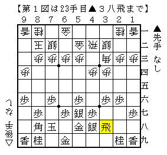
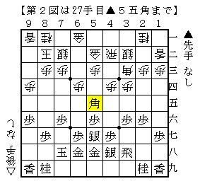
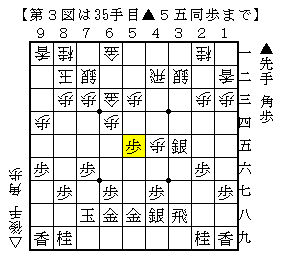
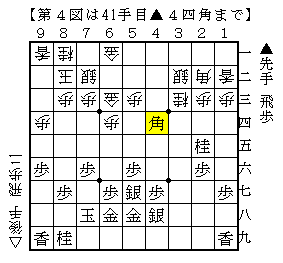
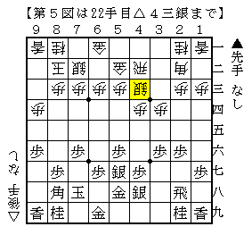

# [四間飛車]マッスル志願４  

  

▲２五歩保留の▲５七銀左急戦。  
△３三角とあらかじめ上がっておくのが手堅いと思っていたが、鷺宮にされて色々考えることに。  
２・３ほどの形を簡単に比較したが、▲２六歩型を咎めるという感じにはなかなかならない。  
一番まずいのは△４三銀と上がる受け方。△２五桂と跳ねられない。  

結局よくわからず、すぐの仕掛けがない形ということで△６四歩△５三歩△１二香型を選択。  
▲青野△藤井のように▲３五歩△同歩▲５五歩、または単に▲５五歩とされてどうかと思っていたが、  
実戦は▲５五角というあまり考えていない手が飛んできた。  

  

対して考えられるのは  
１）△６三金  
２）△６五歩  
３）△４五歩  
ぐらいか。  

１）△６三金  
時間の大半をこれに費やしたが、どうにも振り飛車良しの順が出なかった。  
▲３五歩△同歩▲４六銀△４五歩▲３五銀△５五角▲同歩  

  

で指す手が難しいというのが筆者の読み。  
△２七角と打っても５四と６三の地点が既に埋まってしまっている。  

実戦は▲３五歩△同歩に▲同飛。  
悪いと分かりながら△６三金を選んだのだが、これでも  
△４三銀▲３七桂△３二飛▲２五桂△２二角▲３二飛成△同銀▲３三歩△同桂▲４四角  

  

ぐらいで振り飛車芳しくない。  
よって△５四金から角を追って勝負したが、おおよそそういう金では勝てないとしたもの。  

２）△６五歩  
▲２五桂～▲３三歩で桂の入る格好なので▲６四桂がまず実現しそう。味が悪い。  
感想戦ではその桂を食らってもまだ△６三金よりマシということになったものの、  
仮にそうであったとしても分かってて打たせる順は普通選んだりしませんね。  

３）△４五歩  
一応の結論としては第２図では△４五歩として角交換に持ち込むのが最善では、ということになる。  
▲２五歩の一手が遅れているので５筋７筋のどちらも位を取るのが難しいのでは、というのが筆者の見立て。  
とはいえこの形がどの程度有力なのかは難しく、個人的にはあまり好みではない指し方でもある。  

----------  

ということを踏まえた上で、結局通常形で△４三銀と上がるのであれば  

  

単純に△４三銀と上がってしまうのが正解ということになりそうです。  
△３三角と上がると手堅いというのは藤井システムの将棋と混同していたんでしょうね。  
△３二銀△１二香型を指す際にはまた何か考えましょう。  
