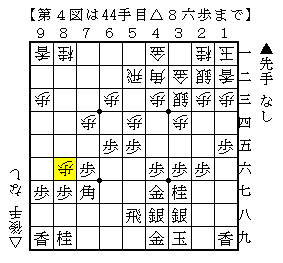

# [三間飛車]マッスル志願５  

適当にコーヤン流をやります。  
とは言っても大体筆者がやったところで新規性は大して無く、  
・コーヤン先生の実戦、コーヤン流実戦編  
・ショパン先生のブログの記事  
・daimonion氏のYoutube動画とブロマガ  
これらをチェックすれば大体筆者と同じ水準で指せるかと。  

----------  

  

この形。  
普通に組んでおいて、いきなり▲２五桂と跳ね出すのが筆者驚愕の新手法。  
次に何が何でも▲４五歩。  

以下△３二金▲４五歩△３三銀▲同桂成△同角▲同角成△同銀  

  

▲７一角△５二飛▲６八飛△５五歩▲同歩△同飛▲５六銀打  

  

筆者が最初にこれを見たのはdaimonion氏のYoutube動画だったのだが、  
▲４五歩△３三銀▲同桂成に△同角とぶつけて難しいのではというのが第一感。  
しかし筆者の実戦を元に検討すると振り飛車も指せそうという感触に。  
（ちなみに上記手順は最初で△８六歩▲同歩△３二金もある）  

上記の形を避けるのであれば、早めに△３三銀と引いておく手もある。  
これには▲４八銀～▲５五歩と捌きにいくのが本家コーヤンの手法（71期C2▲中田功△高見）  

  

ここで手抜いて▲５四歩が格好いい。  

尤もこの手法もやったらやったで大変だとは思うのだが、  
▲４五歩▲４六銀より一手早い上にコンパクトで固いのでやってみる価値は充分あると思う。  

ちなみに△３三銀型に▲２五桂と跳ねていくのは愚策。  
「▲２五桂・△２四銀となったこの形は最悪でも穴熊側が勝負にできる。」  
とは新ニーダの定跡研究の金言。  
最初は意味が分からなかったが、実際に指してみるとよく分かった。  

----------  

従来は端と桂跳ねを後回しにして▲４五歩▲４六銀を組むのが常識だった。  
しかしそれは端攻めを狙う指し方との整合性を取るのが簡単ではないというのが筆者の考え。  
この手法の発見によって居飛車の形に依らず▲１五歩▲３七桂型に組めば良いこととなったので、  
振り飛車側の駒組みの制限が相当緩和されている。  

現代コーヤン流は▲４六銀とは組まないのだ。  
