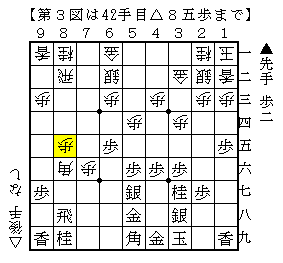

# [三間飛車]マッスル志願６  

  

今回もコーヤン流。  
ここから△５一金▲６五歩△７三桂▲６八飛△８六歩▲同歩△同角がプロでよく見る進行。  

実戦は△８六歩▲同歩△７五歩。  

  

これは見たことがなかった。  
目の前に座っているのがハイレベル県代表複数回の、序盤研究に定評のある超強豪。  
もしかして既にハマっているのかと疑心暗鬼になりながら、約７分の考慮で普通の順を選ぶ。  

・・・なおこの将棋、２０切れである。  

  

ここまで進んでみてようやく思い出したのだが、ほぼ同じ将棋がコーヤン流実戦編に載っている。  
その将棋と同様に▲８六飛△同歩▲４五歩と進めたが、  
△７三桂と跳ねられ先後の差として現れている▲６五歩を衝かれてしまった。  

  

----------  

家に帰ってコーヤン流実戦編を確認してみると  
>>  
ここでは後手がやり損なっている感じで、勝負手が必要な局面です。  
<<  
ということで、自然にやっているつもりで既におかしな順を選んでいたことが判明。  

  

修正案としては単純に▲８八飛と寄ってしまうのがよいのでは、と思う。  
互いに手の出しにくい将棋になるが、持ち歩があるので端攻めをしやすいのが強み。  

----------  

ちなみにこの将棋、ずっと悪かったものの最後の最後に９九の龍取りに▲５五角と出たことで  
後に角の二段ロケットが炸裂して突然必勝になるという事件が発生。  
マイナスであった▲６五歩もこの一局だけで言えば役立たずというわけでもなかったのだ。  

なお、残り５０秒で最後の正着を指せずに寄せ切れなかったというのはまた別の話。  
