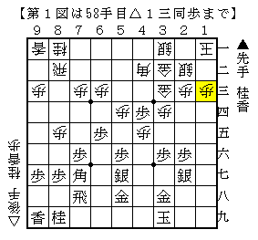
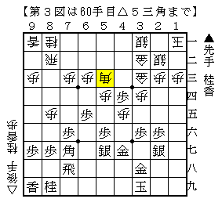

# [三間飛車]マッスル志願７  

大会で先輩と激突。  
知り合ってから１５年程経つが、将棋を指したのはこれが初めて。  
要はそれほど棋力差があるということ。  

  

コーヤン流対△４四歩型。この辺りは定跡化された仕掛け。  
数手前の△３三金では△５三金を予想しており、こちらの方がありがたいのではないかと思っていた。  
なにせ見るからに▲２五桂～▲４三金が刺さりそうな格好だ。  

ここで▲２五桂と▲４七金左を比較し、前者を選択。ただしこれはドボン。  
△４六桂▲同銀△同歩▲３三桂成△同角▲２五桂△６九銀▲３三桂不成△同金▲４三歩成△同金  
▲６八飛△５八銀成▲同飛△４七金▲８八飛△３七香▲４八香△１五桂  

  

と一直線に攻め合われてあっという間に振り飛車負け。  
とてもじゃないが４筋に金やら香を置いている余裕など無かった。  

----------  

感想戦では「この仕掛けは少し無理なのでは。」なんて言葉も出てきたが、  
なんとか互角ぐらいにしないとコーヤン流そのものが終わってしまう。  

とりあえず▲４七金左はどうか。４六に桂香どちらを打たれても一応受かっている。  
△８六歩▲同歩△同角▲８八飛△８五香も▲４八飛と遠くに逃げられる。  
こちらだったか、と思いつつ確認のためBonanza先生にお伺いを立ててみると  
０．１秒で△５三角を指摘されて唖然。((居飛穴が下手なのは分かっていたが、これすら見えないのかと。))  

  

△３三角△５三金型と比べて条件の良さが一目で分かる。  
次の△４四金を防いだり、その後なんとか処置する手立てが見当たらない。  

最初の図に至るまでに▲６八飛を入れるのはどうか。  
仮に△８四飛との交換になれば△６九銀を消しており条件がよくなっている。  

早めに▲６五歩と突いておき、△４二銀▲２五桂△２四角▲６八飛というタイミングが一応ある。  
ただし△５三銀と戻られると後続手が難しい。  

  

△７四歩～△７三角という運用があるのに対して、４筋の力関係が不利であり２五桂もピンチ。  
よってこのタイミングでは▲６八飛は入らず、△３一銀▲６八飛△４二角▲４五歩という順になりそう。  
その場合再び先手陣の新たな最善形を考えることとなるのだが  
▲６八飛の分一手指し手が少なくなるので目指す形が悩ましい。  

石田流に組むのは上策と思えないので何かひねり出したいところだが。。。  
