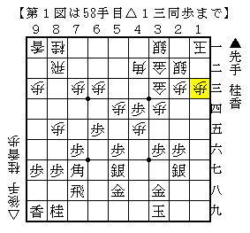
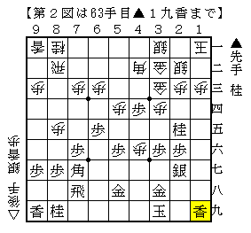
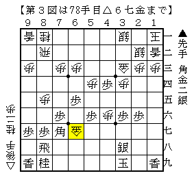

# [三間飛車]マッスル志願８  

前回の続き。  
結局あれからソフト先生の教えもちょいちょい請いつつ検討しました。  

  

▲２五桂△４六桂▲同銀△同歩▲１九香  

  

３三を取ったのが微妙で、端を狙うのが良いようです。  
そもそも手順に固まったところを攻めるのは筋が良くなかったですね。  

ここで△６九銀が相変わらず気になるところですが、▲１三桂成△同銀▲２五桂が好手順。  
すぐに取らずに桂を足すのがいかにも技という感じ。  
以下は△２二金には▲４三歩成、△１二香には▲同成香～▲１九香。  

よって△１二香と受けるのが正着。以下  
▲３三桂成△同角▲２五桂△６九銀▲３三桂不成△同金▲８八飛△５八銀成  
▲同飛△４七金▲８八飛△３八金▲同銀△４七金  

  

これは一例ではありますが、普通に剥がし合っていく感じならこういう具合になるかと。  
筆者の低スペック環境ではこれでほぼ互角と表示されるわけですが、おおよそ人間向きの将棋ではなさそうで。  
もう少し冴えた順が必要かと思われます。  

----------  

そういうことがあって、というわけではないのですが、  
大会が一段落したこともあって先月辺りからモチベーションが低下していました。  
最近はまた初心に戻って、先手番で居飛車を少しずつやり始めています。  
勿論研究は何一つない状態ではあるのですが。  

最近見た将棋で面白かったのはC2▲石田△瀬川と▲佐藤慎△近藤誠。  

前者は▲６六歩が「おっ」と思わせる新手。  
実戦の進行は全盛期の森下先生を思わせる盛り上がり方で、こうなるなら全く不満なし。  
△７四歩～△７六飛～△７三桂と先後逆青野流のような進行となった際にどうするかが課題。  
一度やられて筆者は木っ端微塵と化しました。  

後者は相掛かり浮き飛車に対して後手が飛車先を交換しない指し方。  
▲３七銀にしてもひねり飛車にしても、言われてみれば後手の飛車先交換は結局逆用されるわけで  
そんなことはする必要ないというのは一理あるという感じ。  
ただそれに留まらず△７三銀型から攻めの姿勢を見せるのが現代風。  
実際問題後手を持ってまとめきるのも大変なのでしょうが、  
相掛かりの先手を持つのは日に日にしんどくなってきているような印象を受けますね。  
