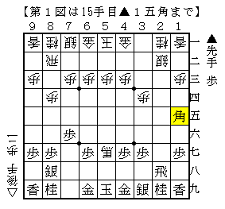
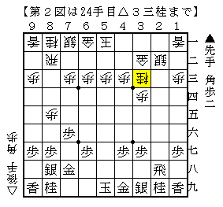
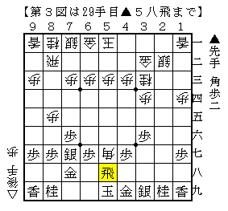
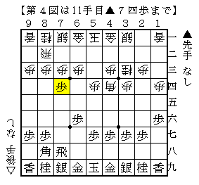
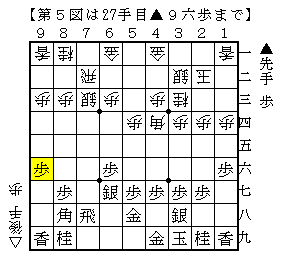
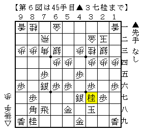

# [将棋生活]マッスル志願９  

元々自分が指した将棋が並ばないことに定評のある筆者だが、  
近年は更に拍車がかかって仕掛け前後までしか並ばないことが多い。  
最近はもうそれはそれで仕方がないと思うことにしている。  
（なお、図面のみ掲載して手順が載らないのはこの理由によるものである）  

----------  

  

先日指した将棋より。  
△８四歩としてから一手損にする指し方には▲２四歩と行くことにしている。  
別にそれで有利になるわけではないのだが、三枚換え定跡の境界条件が不明であるというのがその理由。  
△８四歩型ならやってみてもいいかなと。  

  

ネット・リアル含めほぼ全ての対局では三枚換えに突入せず△２四歩と収める展開に。  
これに対しては１手どこかで手得する指し方があったはずなのだが、完全に失念。  
本譜は普通に指しているはずだがどうにも馬作りが防げなさそうな雰囲気。  

  

角を打たれたので仕方なく飛車をぶつける。  
以下△１三角成▲５三飛成△５二飛で自信のない展開だと思ったが、  
実戦は△８四馬▲７五角△７四馬▲５三飛成△５二金。  
これなら龍を作っている上に、将来▲３八銀～▲３九角～▲１六歩～▲１七角という運用があり十分勝負。  
以下難解な戦いが続いた。  

とはいえ上記の順で自信がないことには変わりないので、この作戦も少し考え直さねばならない。  

----------  

  

石田流相手に△１四歩、それに対して▲１六歩と突き返してきたので相振りになるはずだった。  
直前の△３三桂に代えて△２二飛としておけば問題なくそうなっただろう。  
この▲７四歩は「相振りにはさせませんよ」という、いわば嫌がらせの手。  
「そういえばこう指されて困ったという感想をネット上で見たなあ」  
「また序盤からやっちゃったかなあ。」  

  

しかし冷静に考えれば筆者は居飛車党なので、これといって困ることはないと気付けたのが幸いだった。  
単純に組み合った図は手得の上に端への睨みが強く、少し模様が良さそう。  
ここから△６四歩▲４六歩△６二銀と飛車ぶつけを敢行して少し良くなったと思った。  

  

△８四角で▲７五歩を、△７三角で▲３七桂を強要して図の局面。  
ここで△４二飛としたのが疑問の構想。  
当たり前だが居飛車の角が働くにあたって振り飛車側の角も働いてくる。  
自然に△５二金▲５八金左△７一飛▲８五銀△６二角となれば今度こそ１筋攻めが受からない。  
細かく角を動かし相手の形を制限し生じた弱点を突くという理想的な展開だけに、逃したのは痛かった。  
