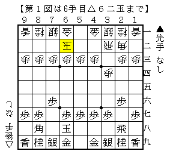
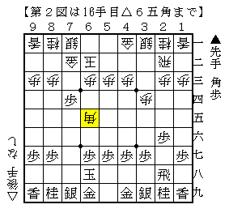
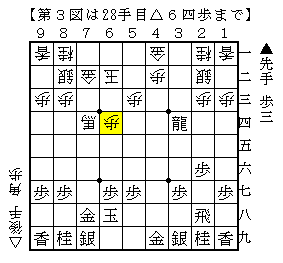
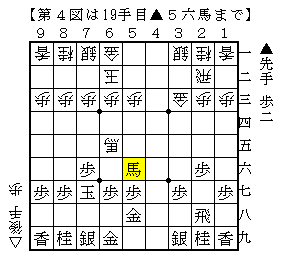

# [その他]マッスル志願１０  

  

久々にやられた４手目△３二飛。  
図の△６二玉では△８八角成▲同銀△４二銀が部分的な最善手。  
▲６八玉△６二玉の交換は居飛車が得をしたと思ったが。  

  

▲６五角△７四角に▲同角～▲７五歩でいっちょ上がりと思いきや、８七が利いていないのをうっかり。  
実戦は以下▲５五角△８二銀▲７八金△４七角成▲２二角成△同銀▲４五飛と持ち駒の飛車を打って龍を作り  
更なる歩得を主張したものの生飛車が残って７四の歩が取られ微妙な感じ。  

  

----------  

改めて考えてみると、▲６五角△７四角に▲４三角成で悪くないのではと思うに至った。  
△４二金▲３四馬△４七角成▲５八金右△６五馬▲７七玉△３三金▲５六馬  

  

こうなると▲６八玉の一手が得になっていることがはっきりしたか。  
元々▲６八玉△６二玉の交換が入っていない形でも▲７七玉が有力だと考えていたので  
当然こちらを選ぶべきであったと反省。  
