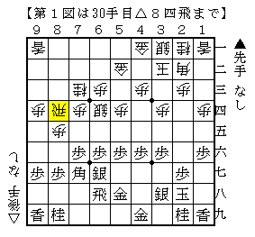
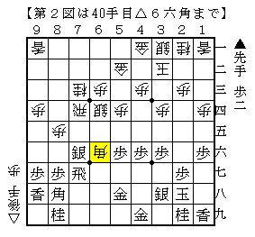
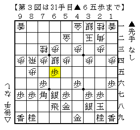
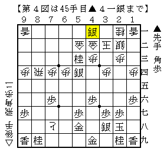
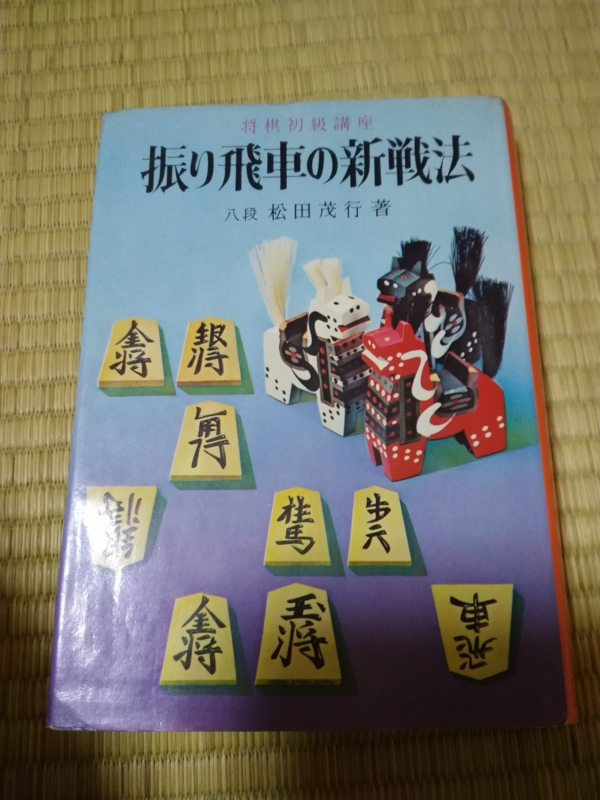
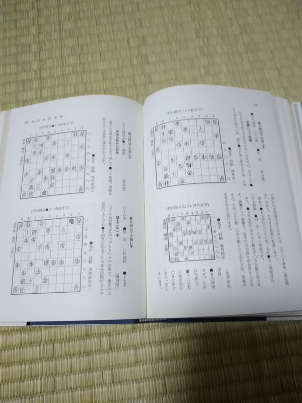
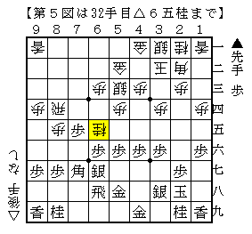
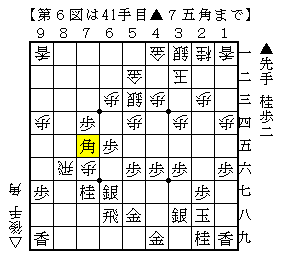

# [四間飛車]マッスル志願１１  

アマレンから学生名人戦の棋譜集が届いたのでパラパラと並べ中。  

  

▲中川滉（岩手県立）△大村（名城）より。たまーにやられて困る指し方。  
▲９八香△７五歩▲７八飛△７四飛▲８八角△７六歩▲同銀△７七歩▲同角△６六角  

  

一局の範疇であると思われるが、普通の急戦と比べると幾分居飛車の条件が良い感じがする。  
以下上手く攻め続けた居飛車が快勝。  

----------  

この指し方昔からあるはずなのにどこにも対策載ってないよなあ、などとぼんやり考えていたところ  
島ノートに記述があるというので早速チェック。  

  

なるほどーこんな先制攻撃が。  

  

うおーうおーすげー。猛攻だ。  

・・・あれ、この攻めどこかで見たような。  

・・・道将連のサイトだ。古棋書探訪。  

  

載ってるー。  
ということはこの順自体は昔からあったわけだ。知らなかったなあ。  

----------  

ちなみに上記の手順に入る直前に  

  

これには  

  

これで振り飛車良しと記されていて非常に勉強になりました。  

（20161211追記）  
居飛車側を持ってこの将棋を結構指したが、▲６五歩とは未だ指されたことはない。  
