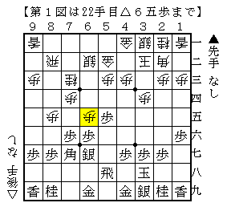
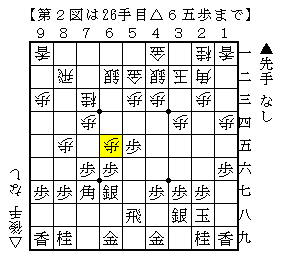
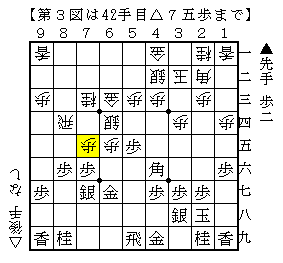

# [中飛車]マッスル志願１２  

C1▲安用寺△青嶋は先手中飛車に△７三桂～△６五歩と仕掛けた将棋に。  

  

これ以前田中寅彦先生が指していた将棋があったなあと思って調べてみると、72期C1▲菅井△田中寅が該当。  

  

▲７八金△６六歩▲同銀以下下図のように進行。  

  

まだまだ難しいのだろうけど、６三に金が行っているので振り飛車側に不満はなさそう。  
こうして見ると▲６五同歩～▲８八角という対応はまずかったかな、という感じではある。  
