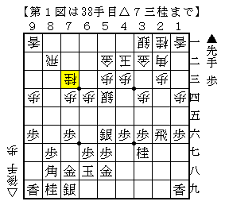
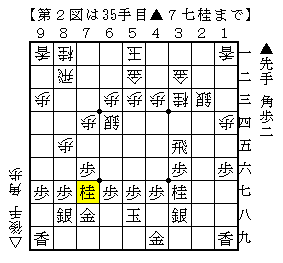
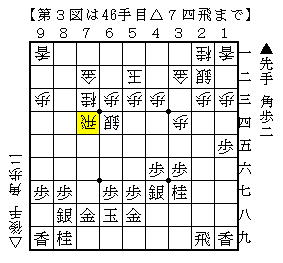
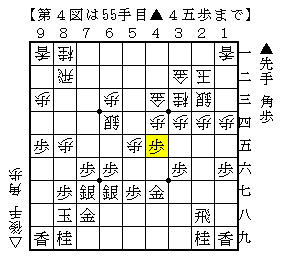

# [相掛かり]マッスル志願１３  

先手矢倉、先手角換わりにあまり興味のない筆者にとって相掛かりは頼みの綱ではあるのだが、  
どうも先手が芳しくないのではという見解が固まってきた感じがする。  

・▲２六飛型  
プロ間では先手の勝率が良くなくあまり見られない形だが、ネット将棋などでは半数以上がこちらだと思われる。  
これには△８六歩と飛車先を切らない指し方が優秀であると考えている。  

対ひねり飛車、▲３七銀ではそれが顕著で、８筋逆襲の筋が緩和されている上に自玉周辺に手をかけられる。  
それでも攻めてくる指し方として新々塚田スペシャル▲２四歩（便宜上こう呼ぶ）が一応あるが、  
正直これで攻め潰されたら相手が強かったと思うしかないだろう。  
今期B1▲郷田△松尾は部分的に新々塚田スペシャルとなったが、その後の進行はとても予定の順とは思えない。  

腰掛け銀なら８筋逆襲の筋がないので、▲４六歩を見て飛車先を切れば通常型に戻る。  
以前はそこから△６五歩～△６二飛として６筋を切っていたが、後手でやるのは少し間に合わないようだ。  
（67期A級▲郷田△木村など。筆者の経験上先手でやってほぼ互角という印象）  
筆者が今有力だと考えているのは下図。  

  

物凄く平凡な図であり、筆者のバイブルよくわかる相掛かりでも▲７五歩で後手危険とされていたが  
21期倉敷藤花２▲里見△甲斐でこの形に組めることが判明。  
http://tohka.kusa.ac.jp/21/kifu/flash/tohka21-2.html  

そうなると今度は先手の手が難しい。  
▲４七金△６三金▲２八飛ぐらいが無難な進行だが、駅馬車定跡よろしく先手が不満。  
上記▲７五歩の周辺含め何かがあってもおかしくないが、現状は先手が芳しくないと筆者はみている。  

なお同じ飛車先を切らない指し方として△７四歩～△７三銀とする指し方もある。  
代表例として今期C2▲佐藤慎△近藤誠を挙げたい。  

  

このような戦いになると６四にいる銀が攻防に非常にバランス良く利いている。  
ただし全体的に高度なバランス感覚を求められ、指しこなすのが非常に難しい。  
（この指し方に限らずコンピューター将棋発の作戦はそういう傾向があると思う）  
筆者も先後問わずこの指し方を試してみたが、ほとんど勝てた試しがない。  

持久戦になった際のビジョンも求められる。  
今期C2▲脇△近藤誠は下図のような駒組み。  

  

これはこれで一局ではあるが、飛車先を切らないという当初の考え方からは離れた将棋になっている。  
個人的にはこうなるのであれば不満。  

（20161005追記）  
放っとくと△６五銀とされて先手の指し手が難しいかもしれない。  
実戦は▲６六歩△５五銀。  

王座戦▲松尾△佐藤天は引き飛車腰掛け銀対△７三銀から完全持久戦となり下図。  

  

これは評価の難しい将棋。  
個人的には△６三銀・△５四銀型を目指す指し方がアマ向きだと考えている。  

長くなってきたので続きは次回。  
