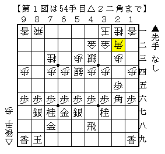
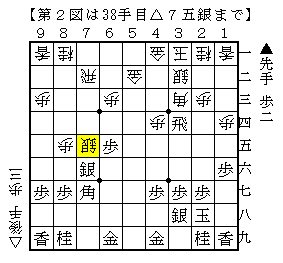
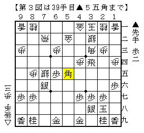

# [将棋生活]マッスル志願１５  

今年最後の大会。  

  

▲２六歩△３四歩▲２五歩△３三角▲４八銀△３二銀▲６八玉△４四歩▲５六歩△８四歩という出だし。  
以下後手右玉含みの駒組み→相手の形が決めすぎと見て力戦相居飛車となり図の局面。  
一度入った玉を３一に引き直し、更に角までそうするのではどうなのかと思ったが  
先手の打開も難しいようで結果は千日手。  

ところで筆者の成績を振り返ってみると、この１年で６局も千日手となった将棋を指していることが判明。  
いずれも序中盤の折衝で早々になったものであり、作戦がまずまず機能している証と見たい。  
（なお指し直し局の成績はお察し）  

  

指し直し局。  
▲７五同銀△同飛▲４四飛が実戦の進行だが、後の△４八歩が厳しく見た目以上に振り飛車が芳しくなかった。  
少し戻って▲３四飛とこちらを取る前にさっさと決戦を挑む方が人間的には良さそうか。  

さて本題はここからで、最近裏技クルーに加入していただいたスマホ技巧氏に見解を伺ってみたところ  

  

えっ？  

以下進行の一例は  
△７六銀▲９一角成△２二玉▲６四歩△同歩▲３六飛△３四歩▲５一香  
以下十数手。  
一応評価値は+400ちょっと、信じるかどうかは筆者次第というところか。  
