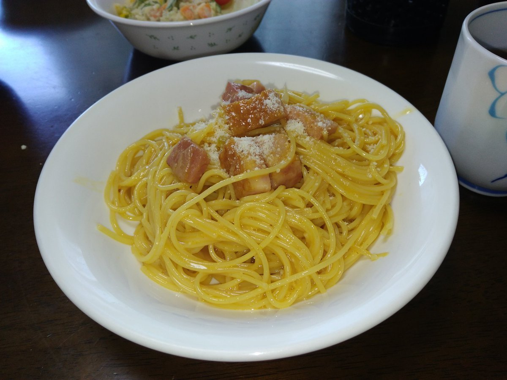

# 20180723

最近思い出してちょっと気になっていた形。

```
後手の持駒：なし 
９ ８ ７ ６ ５ ４ ３ ２ １ 
+---------------------------+ 
|v香 ・ ・v金 ・ ・ ・v桂v香|一 
| ・v玉v銀 ・ ・v飛 ・ ・ ・|二 
| ・v歩v桂v金v歩v銀v角v歩v歩|三 
|v歩 ・v歩v歩 ・v歩v歩 ・ ・|四 
| ・ ・ ・ ・ ・ ・ ・ 歩 ・|五 
| ・ ・ 歩 歩 歩 ・ ・ ・ ・|六 
| 歩 歩 角 金 銀 歩 歩 ・ 歩|七 
| 香 銀 ・ ・ ・ ・ ・ 飛 ・|八 
| 玉 桂 ・ 金 ・ ・ ・ 桂 香|九 
+---------------------------+ 
先手の持駒：なし 
手数＝32 △４三銀 まで
```

石井本の自戦記パートにあったもの。▲７八金なら△５四銀、▲７九金なら△５二銀という意図。実戦は▲７九金△５二銀▲５九角以下７筋交換、銀冠＋△５三銀で振り飛車も悪くない感じ。

ところで図で▲３六歩と突かれたら振り飛車はどう待つか。▲３六歩△Ｘ▲７八金△５四銀という手順を考えればＸ＝４五歩ということになるが、▲３六歩△４五歩▲７九金となった際に△５二銀という手はあまりに違和感がある。

そもそも▲３六歩△４五歩にいきなり仕掛けられても自信があるわけではないので△４五歩自体どうなのかということになるが、かと言って代わる手が筆者には思いつかない。△４三銀という形で待機するのは何かと辛い印象。

---

お料理日記を標榜しているのでたまにはそちらも。



カルボナーラ。作り方は下記動画そのまんま。  
https://www.youtube.com/watch?v=5wRQRKjZ3k4

作って気が付いた点をあえて挙げるとすれば

1. ベーコンは大きすぎてもどうか

安いベーコンでかなり大きく切ったからか脂が大して出ず。もう少し細かく切ってカリカリになるまで火を通す方が良かったかも。そもそももうちょっと良いパンチェッタなりを使えという話はあります。

2. 麺を茹でる湯に塩を入れる

当然やるべきことだが、どうにも面倒で飛ばしがち。味がシンプルな料理の場合塩味は重要性が上がるのでちゃんとやろう。

3. 最後に粗挽き胡椒をかける

元レシピでもやってるし、そもそもカルボナーラを構成する重要な要素。味付けのコショウが割と多めに入ってしまったので飛ばしたものの、いざ食べるとかけた方が良いとなったので結局かけることに。

というぐらい。割と簡単に出来たのでオススメです。
