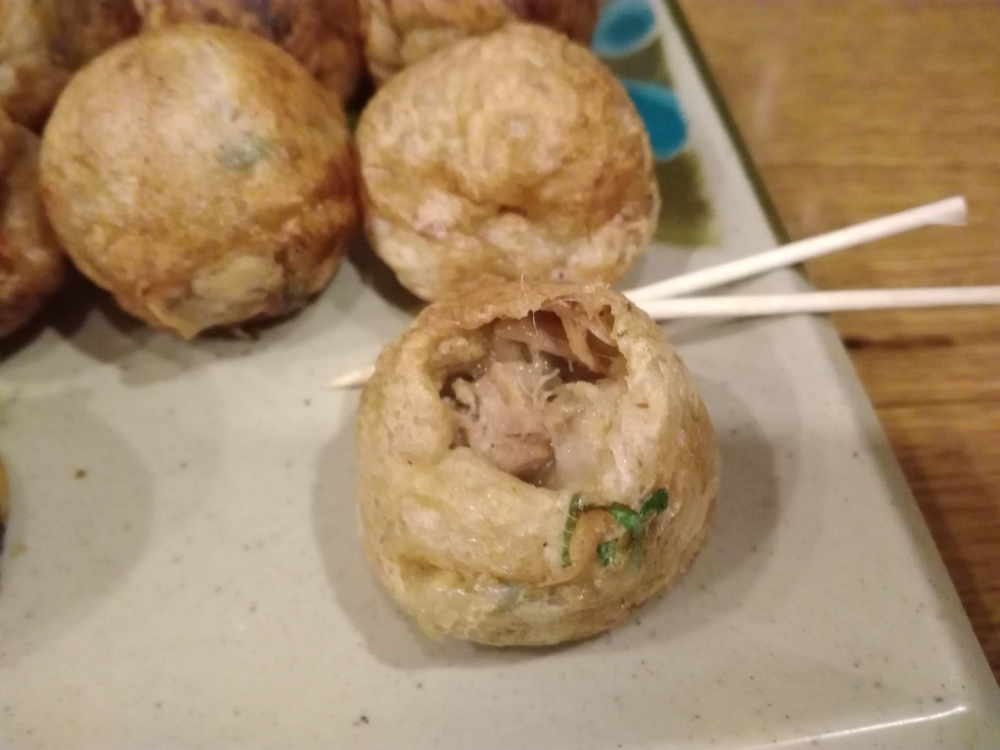
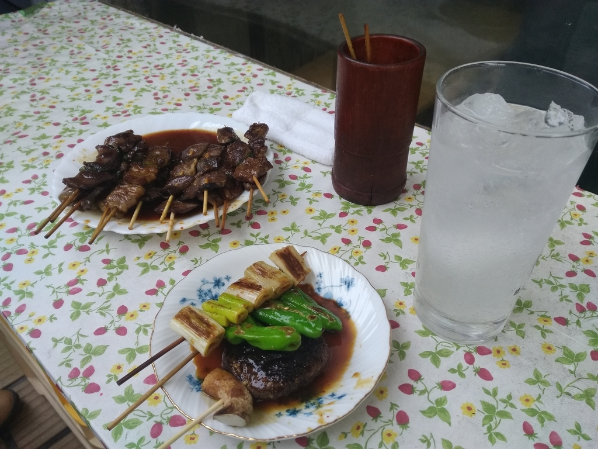
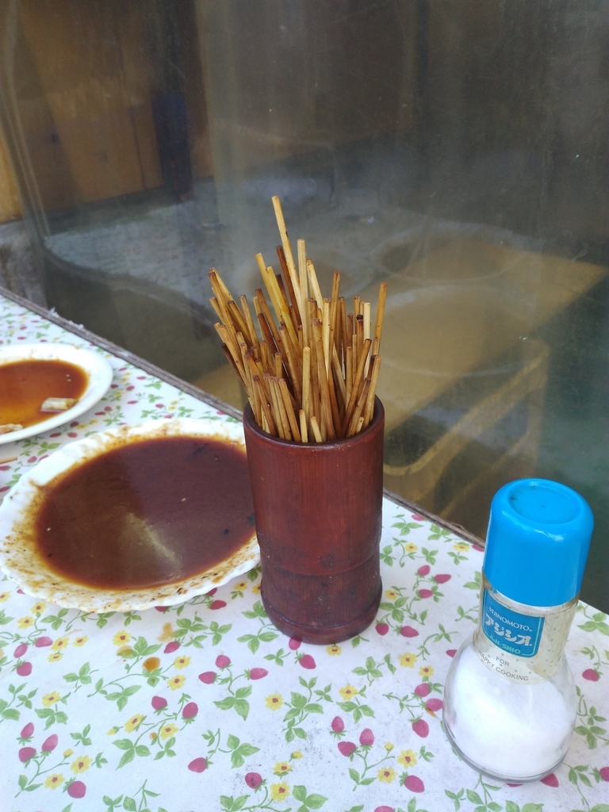

# 20181203

## 11/23 会津屋梅田店

たこ焼きの原型であるラヂオ焼きをいただく。

たこと比べると旨みが増している感じで良い。

## 12/1 中畑商店

じゃりン子チエに出てくるホルモン焼きを探す旅 :: デイリーポータルZ  
https://dailyportalz.jp/kiji/170327199137/page/4

Twitterにこの記事を貼ったところ食べに行く会が開催された。

店内立ち食い立ち飲みスタイルだが人数もあり外で。ホルモン自体はあっさりしており串も小ぶり、たれの旨みがありながらもしつこくない感じ。ひたすら食える。

4人で会計が9000円。トータルでおおよそ100本ぐらい。

来たときには店内に常連のおっちゃんがいて、食べていると相当な年齢と思しきお婆ちゃんが包みでまとめて買いに来たり、女子小学生三人組がやってきてそれぞれ串を片手に仲良く去っていったり、我々と同じような観光客らしき人々も入れ代わり立ち代わり。類を見ない客層の広さがとても面白い。一方で冒頭の記事にあった稲荷市場跡はすぐ隣のマンション再開発のためか既に姿を消しており、一抹の寂しさを覚えた。